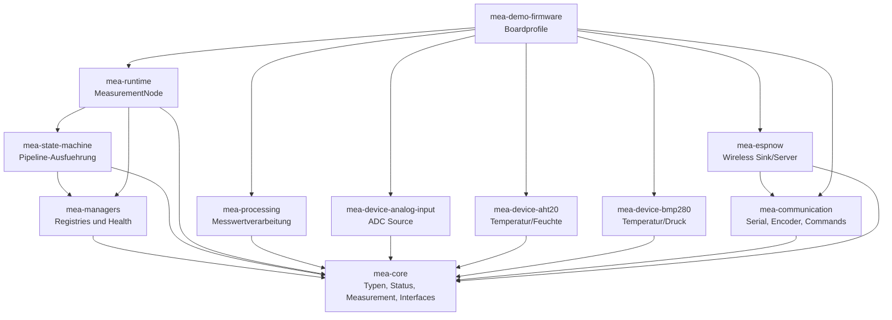

# MEA Embedded Workspace

MEA steht fuer **Modular Embedded Architecture**. Dieser Workspace ist der
Meta-Workspace fuer mehrere PlatformIO-Repositories, die zusammen eine modulare
Embedded-Plattform bilden.

Dieses README beschreibt den **Zielstand nach dem Umbauplan** in
[docs/08-UMBAUPLAN-MODULARE-EINHEIT.md](docs/08-UMBAUPLAN-MODULARE-EINHEIT.md).
Der Zweck: neue Sensoren, Ausgaben und Firmware-Profile sollen nach einem
einfachen, wiederholbaren Muster eingebaut werden.

## Zielbild



## Repositories

| Repository | Rolle im Zielsystem |
|---|---|
| `mea-core` | stabile gemeinsame Sprache: IDs, Zeit, Status, Measurement, Interfaces |
| `mea-managers` | feste Registries, Locator-Sichten und Component-Health |
| `mea-state-machine` | nicht blockierende Messwert-Pipelines ueber IDs |
| `mea-runtime` | `MeasurementNode` als einfache Fassade fuer Knoten |
| `mea-processing` | hardwarefreie Prozessoren fuer Skalierung, Filter und Validierung |
| `mea-device-analog-input` | ADC-Messquelle mit testbarer HAL |
| `mea-device-aht20` | AHT20 Shared-Device plus Temperatur-/Feuchte-Sources |
| `mea-device-bmp280` | BMP280 Shared-Device plus Temperatur-/Druck-Sources |
| `mea-communication` | Byte-Transport, Encoder, Serial-Sink und Command-Decoder |
| `mea-espnow` | ESP-NOW Client, Server und Measurement-Sink |
| `mea-demo-firmware` | Composition Root mit Profilen fuer konkrete ESP32-Knoten |

## Wichtigste Regel

Libraries bleiben wiederverwendbar. Nur `mea-demo-firmware` kennt konkrete
Pins, Boardwerte, App-IDs und Profilentscheidungen. Alle anderen Repos sprechen
ueber `mea-core`-Interfaces.

## Geplanter Firmware-Einstieg

Nach dem Umbau wird die Demo mehrere klare PlatformIO-Profile besitzen:

| Environment | Zweck |
|---|---|
| `native` | Host-Integrationstests |
| `esp32dev_analog_serial` | ADC -> Processing -> Serial CSV |
| `esp32dev_i2c_serial` | AHT20/BMP280 -> Serial CSV |
| `esp32dev_espnow_client` | Sensor-Node -> ESP-NOW |
| `esp32dev_espnow_server` | ESP-NOW Empfaenger -> Serial |
| `esp32dev_test` | Embedded-Smoke-Build |

```bash
cd repositories/mea-demo-firmware
pio test -e native
pio run -e esp32dev_analog_serial
pio run -e esp32dev_i2c_serial
pio run -e esp32dev_espnow_client
pio run -e esp32dev_espnow_server
```

## Workspace-Skripte

Alle Skripte sollen dieselbe zentrale Repo-Liste nutzen:

```text
scripts/repos.sh
```

Damit laufen Initialisierung, Tests, Builds, Remotes und Pushes immer ueber die
gleiche Menge an Repositories.

Geplanter Standardablauf:

```bash
./scripts/init-repositories.sh
./scripts/test-all.sh
./scripts/build-all.sh
./scripts/verify-all.sh
```

## Git und Remotes

Der Workspace selbst ist ein Meta-Repository fuer Dokumentation, Skripte,
Templates und einen Source-Snapshot. Jedes Repo unter `repositories/` soll
zusaetzlich ein eigenes Git-Repository sein.

Gitea/Forgejo-Token unter zsh:

```zsh
read -s "GITEA_TOKEN?Gitea-Token: "
echo
export GITEA_TOKEN
```

Danach:

```bash
./scripts/create-gitea-repositories.sh \
  'http://192.168.178.99:3000' \
  'Theo' \
  user \
  private
./scripts/push-all.sh
unset GITEA_TOKEN
```

## Wichtige Dokumente

- [docs/08-UMBAUPLAN-MODULARE-EINHEIT.md](docs/08-UMBAUPLAN-MODULARE-EINHEIT.md)
- [docs/02-ARCHITEKTUR.md](docs/02-ARCHITEKTUR.md)
- [docs/00-VERWENDUNG-UND-KONFIGURATION.md](docs/00-VERWENDUNG-UND-KONFIGURATION.md)
- [docs/05-NEUE-LIBRARY-ANLEGEN.md](docs/05-NEUE-LIBRARY-ANLEGEN.md)
- [docs/07-CODE-TOUR-FUER-TEAMS.md](docs/07-CODE-TOUR-FUER-TEAMS.md)
- [docs/03-GIT-UND-VERSIONIERUNG.md](docs/03-GIT-UND-VERSIONIERUNG.md)
- [docs/04-TESTS-UND-QUALITAET.md](docs/04-TESTS-UND-QUALITAET.md)

## Designregeln

1. Keine zyklischen Repository-Abhaengigkeiten.
2. Keine App-IDs oder Board-Pins in Libraries.
3. Keine Heap-Besitzmodelle in der Runtime.
4. `update(nowMs)` blockiert nicht.
5. `Status` beschreibt Operationen, `Measurement::quality` beschreibt Datenqualitaet.
6. `MeasurementNode` ist der bevorzugte Weg fuer neue Firmware-Verdrahtung.
7. Neue Sensoren implementieren `IMeasurementSource`; Shared-Chips implementieren `IDevice`.
8. Neue Ausgaben implementieren `IMeasurementSink`.

## Lizenz

Die Beispiel-Repositories stehen unter der MIT-Lizenz.
