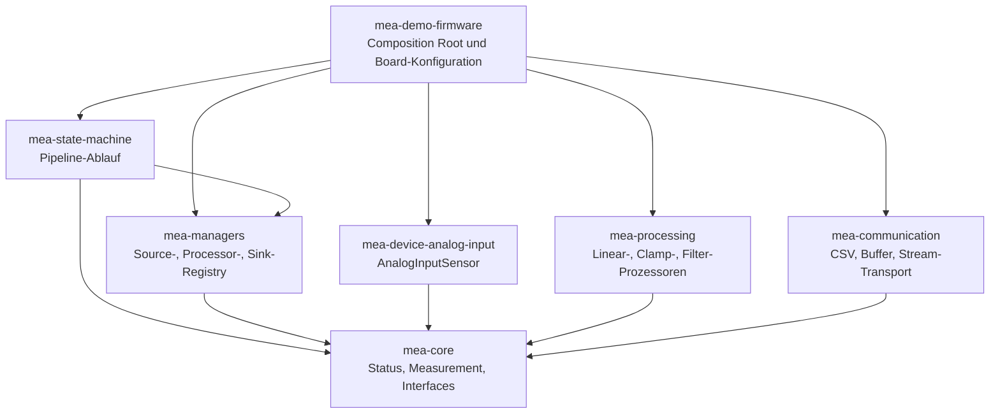
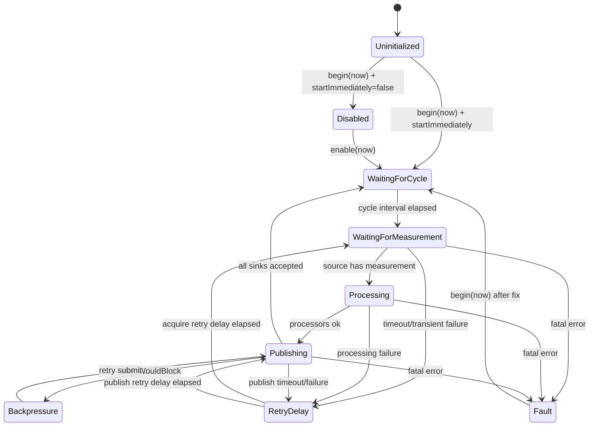
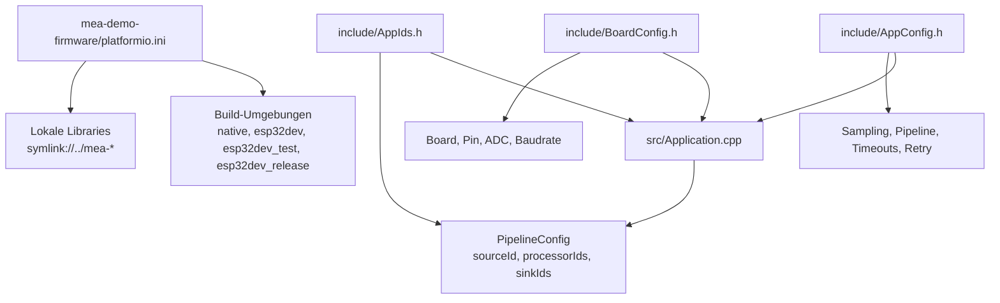

# Verwendung und Konfiguration

Diese Doku ist der praktische Einstieg in den MEA-Workspace. Sie beschreibt,
welches Repository welche Aufgabe hat, wie die Demo-Firmware benutzt wird und
an welchen Stellen Hardware, Timing, Verarbeitung und Kommunikation angepasst
werden.

MEA steht fuer **Modular Embedded Architecture**: kleine PlatformIO-Libraries
mit klaren Interfaces, statischer Speicherstrategie und einer Demo-Firmware als
Composition Root.

## Repo-Uebersicht

| Repository | Typ | Aufgabe | Haupt-Header |
|---|---|---|---|
| `mea-core` | Basis-Library | Statusmodell, Messwertmodell, IDs, Interfaces | `MeaCore.h` |
| `mea-device-analog-input` | Device-Library | Nicht blockierender analoger Sensor fuer Arduino-kompatible Targets | `MeaAnalogInput.h` |
| `mea-processing` | Processing-Library | Hardwareunabhaengige Messwertverarbeitung | `MeaProcessing.h` |
| `mea-communication` | Communication-Library | Encoder, Transport und Sinks fuer Messwerte | `MeaCommunication.h` |
| `mea-managers` | Registry-Library | Registries mit fester Kapazitaet und ohne Heap-Besitz | `MeaManagers.h` |
| `mea-state-machine` | Ablauf-Library | Nicht blockierende Messwert-Pipeline ueber Komponenten-IDs | `MeaStateMachine.h` |
| `mea-demo-firmware` | Anwendung | ESP32-Demo, Konfiguration, Verdrahtung, Build und Tests | `src/Application.h` |

Der Workspace-Ordner selbst ist kein Git-Repository. Jede Library und die
Firmware sind eigene Repositories unter `repositories/`.

## Architekturgraph



Die wichtigste Regel: Nur `mea-demo-firmware` kennt konkrete Hardware, Pins,
Baudrate und die echte Objektverdrahtung. Die Libraries bleiben wiederverwendbar
und kennen nur Interfaces, IDs und Konfigurationsstrukturen.

## Laufzeit-Datenfluss

Die aktuelle Demo liest GPIO 34 am ESP32, berechnet aus dem ADC-Rohwert eine
Spannung, begrenzt den Wert auf den erlaubten Bereich und sendet CSV ueber
Serial.

```mermaid
flowchart LR
    Pin[GPIO 34<br/>ADC1_CH6] --> Reader[ArduinoAnalogReader]
    Reader --> Sensor[AnalogInputSensor<br/>8 Samples<br/>max. 2 pro update()]
    Sensor --> Raw[Measurement<br/>RawAnalog / RawCount]
    Raw --> Linear[LinearProcessor<br/>raw * gain + offset]
    Linear --> Volt[Measurement<br/>Voltage / Volt]
    Volt --> Clamp[ClampProcessor<br/>0.0 bis 3.3 V]
    Clamp --> Sink[BufferedMeasurementSink<br/>Queue 8<br/>Frame 96 B]
    Sink --> Encoder[CsvMeasurementEncoder<br/>3 Dezimalstellen]
    Encoder --> Transport[ArduinoStreamTransport]
    Transport --> Serial[Serial USB<br/>115200 Baud]
```

CSV-Format:

```text
version;source_id;kind;unit;value;sampled_at_ms;sequence;quality
```

Beispiel:

```text
1;100;2;2;1.650;12345;42;0
```

## Pipeline-Zustaende

Die `MeasurementPipelineMachine` arbeitet nicht blockierend. Jeder `loop()`-
Durchlauf ruft `application.update(millis())` auf; die State Machine macht nur
begrenzte Arbeit und kehrt wieder zurueck.



Fatal sind zum Beispiel ungueltige Konfiguration, fehlende Komponenten-ID oder
interne Fehler. Timeouts und Backpressure werden gemaess `RetryPolicy`
behandelt; die Pipeline kann danach weiterlaufen.

## Konfigurationskarte



## Schnellstart

Vom Workspace-Root:

```bash
./scripts/install-arch-tools.sh
./scripts/init-repositories.sh
code MEA-Embedded.code-workspace
```

Demo-Firmware testen und bauen:

```bash
cd repositories/mea-demo-firmware
pio test -e native
pio run -e esp32dev
pio run -e esp32dev -t upload
pio device monitor -b 115200
```

Alle lokal vorgesehenen Pruefungen:

```bash
./scripts/verify-all.sh
```

`verify-all.sh` fuehrt Formatcheck, `cppcheck`, native Tests und ESP32-Builds
aus.

## Hardware anschliessen

Standard-Demo:

```text
Spannungsquelle 0 ... 3.3 V  -> GPIO 34
GND der Quelle               -> GND ESP32
```

Ein einfacher Test ist ein 10-kOhm-Potentiometer zwischen `3V3` und `GND`, der
Schleifer geht auf GPIO 34.

Wichtig:

- GPIO 34 ist nur Eingang.
- Nie mehr als 3.3 V an den Pin legen.
- ADC1-Pins verwenden, wenn WLAN spaeter relevant wird.
- Das Demo-ADC-Modell ist linear und einfach gehalten; fuer Praezision braucht
  der ESP32 Kalibrierung und passende ADC-Daempfung.

Details stehen in `repositories/mea-demo-firmware/docs/wiring.md`.

## Board konfigurieren

Datei:

```text
repositories/mea-demo-firmware/include/BoardConfig.h
```

Wichtige Werte:

```cpp
constexpr std::uint8_t kAnalogInputPin = 34;
constexpr std::uint32_t kAdcMaximumRaw = 4095;
constexpr float kAdcReferenceVolt = 3.3F;
constexpr std::uint32_t kSerialBaudRate = 115200;
```

Typische Anpassungen:

| Ziel | Aenderung |
|---|---|
| Anderer ADC-Pin | `kAnalogInputPin` aendern und Verdrahtung pruefen |
| Anderes Board | `board = ...` in `platformio.ini` und Boardwerte in `BoardConfig.h` anpassen |
| Andere ADC-Aufloesung | `kAdcMaximumRaw` anpassen |
| Andere Referenzspannung | `kAdcReferenceVolt` anpassen |
| Andere serielle Geschwindigkeit | `kSerialBaudRate` und `monitor_speed` angleichen |

Board-Liste anzeigen:

```bash
pio boards esp32
```

## Anwendung konfigurieren

Datei:

```text
repositories/mea-demo-firmware/include/AppConfig.h
```

### Abtastung

```cpp
constexpr mea::TimestampMs kSensorSampleIntervalMs = 250;
constexpr std::uint16_t kSamplesPerMeasurement = 8;
constexpr std::uint8_t kMaxSamplesPerUpdate = 2;
```

- `kSensorSampleIntervalMs`: Abstand zwischen Sensor-Samples.
- `kSamplesPerMeasurement`: Anzahl Samples pro ausgegebenem Messwert.
- `kMaxSamplesPerUpdate`: Arbeit pro `update()`-Aufruf, damit die Loop nicht
  blockiert.

### Verarbeitung

```cpp
constexpr float kAdcToVoltGain =
    board::kAdcReferenceVolt / static_cast<float>(board::kAdcMaximumRaw);
constexpr float kVoltageOffset = 0.0F;
constexpr float kVoltageMin = 0.0F;
constexpr float kVoltageMax = board::kAdcReferenceVolt;
```

Der `LinearProcessor` rechnet:

```text
Volt = RawCount * kAdcToVoltGain + kVoltageOffset
```

Der `ClampProcessor` begrenzt danach auf `kVoltageMin` bis `kVoltageMax`.

### Kommunikation

```cpp
constexpr std::size_t kSinkQueueCapacity = 8;
constexpr std::size_t kSinkFrameSize = 96;
constexpr std::uint8_t kCsvDecimalPlaces = 3;
```

- Groessere Queue: weniger Dropped Measurements bei kurzer Serial-Backpressure.
- Groesserer Framepuffer: mehr Reserve fuer laengere Encodings.
- Mehr Dezimalstellen: genauere Ausgabe, aber laengere CSV-Zeilen.

### Pipeline

```cpp
constexpr mea::TimestampMs kPipelineCycleIntervalMs = 1000;
constexpr mea::TimestampMs kAcquisitionTimeoutMs = 2000;
constexpr mea::TimestampMs kPublishTimeoutMs = 500;
constexpr mea::RetryPolicy kRetryPolicy{250, 3};
constexpr bool kStartImmediately = true;
constexpr std::size_t kManagerCapacity = 4;
```

- `kPipelineCycleIntervalMs`: Abstand zwischen Pipeline-Zyklen.
- `kAcquisitionTimeoutMs`: maximale Wartezeit auf einen Messwert.
- `kPublishTimeoutMs`: maximale Zeit fuer Sink-Uebergabe.
- `kRetryPolicy`: Wartezeit und Anzahl Wiederholungen pro Zyklusfehler.
- `kManagerCapacity`: maximale Anzahl registrierbarer Sources, Processors und
  Sinks je Manager.

## Komponenten-IDs konfigurieren

Datei:

```text
repositories/mea-demo-firmware/include/AppIds.h
```

Aktuelle IDs:

| ID | Komponente |
|---:|---|
| `100` | `AnalogInput1` |
| `200` | `RawToVoltage` |
| `201` | `VoltageClamp` |
| `300` | `SerialOutput` |
| `400` | `MeasurementPipeline` |

Regeln:

- ID `0` ist reserviert.
- IDs muessen innerhalb einer Registry eindeutig sein.
- Die Pipeline findet Komponenten nur ueber diese IDs.
- Neue Komponenten erst in `AppIds.h` anlegen, dann in `Application.cpp`
  instanziieren, registrieren und in die Pipeline aufnehmen.

## Composition Root anpassen

Datei:

```text
repositories/mea-demo-firmware/src/Application.cpp
```

Dort passiert die echte Verdrahtung:

1. HAL-Objekte und Komponenten werden als Member der `Application` erzeugt.
2. `begin()` registriert Sources, Processors und Sinks in den Managern.
3. Danach werden Transport und Manager initialisiert.
4. `pipeline_.begin(millis())` loest die IDs zu echten Komponenten auf.
5. `update(nowMs)` treibt Quellen, Transport, Sinks und Pipeline an.

Pipeline-Reihenfolge:

```cpp
constexpr mea::ComponentId kProcessorIds[] = {
    ids::RawToVoltage,
    ids::VoltageClamp,
};
constexpr mea::ComponentId kSinkIds[] = {
    ids::SerialOutput,
};
```

Wenn ein Prozessor entfernt, ergaenzt oder umsortiert wird, wird dieses Array
angepasst. Die Reihenfolge ist die Ausfuehrungsreihenfolge.

## PlatformIO-Umgebungen

Datei:

```text
repositories/mea-demo-firmware/platformio.ini
```

| Umgebung | Zweck | Befehl |
|---|---|---|
| `native` | Pipeline-Integrationstest auf dem PC | `pio test -e native` |
| `native_debug` | Native-Test mit Debug-Build | `pio test -e native_debug` |
| `esp32dev` | Firmware bauen, flashen, monitoren | `pio run -e esp32dev` |
| `esp32dev_test` | Embedded-Smoke-Test auf Board | `pio test -e esp32dev_test` |
| `esp32dev_release` | Release-Build mit `NDEBUG` | `pio run -e esp32dev_release` |

Die Demo nutzt lokale Dependencies:

```ini
lib_deps =
    mea-core=symlink://../mea-core
    mea-processing=symlink://../mea-processing
    mea-managers=symlink://../mea-managers
    mea-state-machine=symlink://../mea-state-machine
    mea-device-analog-input=symlink://../mea-device-analog-input
    mea-communication=symlink://../mea-communication
```

Dadurch sind Library-Aenderungen sofort im Firmware-Build sichtbar.

## Standardbefehle

Workspace-weit:

| Aufgabe | Befehl |
|---|---|
| Alle Repos initialisieren | `./scripts/init-repositories.sh` |
| Formatieren | `./scripts/format-all.sh` |
| Format pruefen | `./scripts/check-format.sh` |
| Statische Analyse | `./scripts/analyze-all.sh` |
| Native Tests aller Repos | `./scripts/test-all.sh` |
| ESP32-Builds | `./scripts/build-all.sh` |
| Alles pruefen | `./scripts/verify-all.sh` |
| Demo bauen | `./scripts/build-demo.sh` |

In der Demo-Firmware:

| Aufgabe | Befehl |
|---|---|
| Native Tests | `pio test -e native` |
| Firmware bauen | `pio run -e esp32dev` |
| Firmware flashen | `pio run -e esp32dev -t upload` |
| Monitor oeffnen | `pio device monitor -b 115200` |
| Embedded-Test | `pio test -e esp32dev_test` |
| Abhaengigkeiten anzeigen | `pio pkg list -e esp32dev` |
| Statische Analyse | `pio check -e esp32dev` |

## Neue Library einbinden

1. Vorlage kopieren:

```bash
cp -a templates/library-template repositories/mea-device-neuer-sensor
```

2. `library.json`, Header, README und Tests anpassen.

3. Interface passend zur Rolle implementieren:

| Rolle | Interface |
|---|---|
| Sensor/Quelle | `mea::IMeasurementSource` |
| Verarbeitung | `mea::IMeasurementProcessor` |
| Ausgabe/Sink | `mea::IMeasurementSink` |

4. Dependency in `mea-demo-firmware/platformio.ini` ergaenzen:

```ini
lib_deps =
    mea-device-neuer-sensor=symlink://../mea-device-neuer-sensor
```

5. In `Application.h/.cpp` instanziieren, registrieren und ueber IDs in die
   Pipeline aufnehmen.

6. Tests ausfuehren:

```bash
cd repositories/mea-device-neuer-sensor
pio test -e native
cd ../mea-demo-firmware
pio test -e native
pio run -e esp32dev
```

## Git und Releases

Jedes Repository wird separat versioniert. Fuer lokale Entwicklung bleiben die
`symlink://`-Dependencies sinnvoll. Fuer reproduzierbare Releases werden Tags
oder Commit-Hashes in `lib_deps` gepinnt.

Release einer Library:

```bash
cd repositories/mea-processing
git add library.json
git commit -m "chore: release 0.2.0"
git tag -a v0.2.0 -m "MEA Processing 0.2.0"
git push origin main --follow-tags
```

Release-Dependency in der Firmware:

```ini
lib_deps =
    mea-processing=git+ssh://git@gitserver.local/srv/git/embedded/mea-processing.git#v0.2.0
```

Remote-Setup ist in `docs/03-GIT-UND-VERSIONIERUNG.md` beschrieben.

## Typische Anpassungen

### Messrate erhoehen

1. `kSensorSampleIntervalMs` kleiner setzen.
2. `kPipelineCycleIntervalMs` passend kleiner setzen.
3. Bei Backpressure `kSinkQueueCapacity` erhoehen.
4. `pio test -e native` und `pio run -e esp32dev` ausfuehren.

### Anderen Sensor verwenden

1. Neue Device-Library anlegen oder bestehende ergaenzen.
2. Sensor implementiert `IMeasurementSource`.
3. Neue ID in `AppIds.h` anlegen.
4. Sensor in `Application` erzeugen und registrieren.
5. `pipelineCfg.sourceId` auf die neue Source-ID setzen.

### Weitere Verarbeitung einfuegen

1. Prozessor implementiert `IMeasurementProcessor`.
2. ID in `AppIds.h` anlegen.
3. Prozessor als Member in `Application` aufnehmen.
4. In `processors_.registerComponent(...)` registrieren.
5. ID in `kProcessorIds[]` an der richtigen Stelle einfuegen.

### Weitere Ausgabe einfuegen

1. Sink implementiert `IMeasurementSink`.
2. ID in `AppIds.h` anlegen.
3. Sink in `Application` erzeugen und registrieren.
4. ID in `kSinkIds[]` aufnehmen.
5. Falls mehrere Sinks verwendet werden, `kManagerCapacity` und
   `MeasurementPipelineMachine::kMaxSinks` beachten.

## Fehlerbilder

| Symptom | Wahrscheinliche Ursache | Pruefung |
|---|---|---|
| Keine CSV-Ausgabe | Board nicht geflasht, falscher Port, falsche Baudrate | `pio device list`, `pio device monitor -b 115200` |
| `[mea] register ... DuplicateId` | ID doppelt registriert | `AppIds.h` und Registrierung pruefen |
| `[mea] pipeline begin: NotFound` | Pipeline-ID verweist auf nicht registrierte Komponente | `kProcessorIds[]`, `kSinkIds[]`, `sourceId` pruefen |
| Sehr wenige Werte | Pipeline-Zyklus oder Sampling zu langsam | `AppConfig.h` pruefen |
| `WouldBlock`/Timeouts beim Publizieren | Sink-Queue oder Serial-Ausgabe kommt nicht hinterher | Queue vergroessern, Baudrate pruefen |
| ADC-Wert springt stark | Eingang hochohmig/offen oder falsche Verdrahtung | GND verbinden, Poti/Signalquelle pruefen |

## Weiterfuehrende Dokumente

- `docs/01-ARCH-LINUX-VSCODE.md`: Einrichtung unter Arch Linux und VS Code.
- `docs/02-ARCHITEKTUR.md`: Architekturprinzipien und Schichten.
- `docs/03-GIT-UND-VERSIONIERUNG.md`: Repositories, Remotes, Tags und Releases.
- `docs/04-TESTS-UND-QUALITAET.md`: Testarten und Qualitaetsregeln.
- `docs/05-NEUE-LIBRARY-ANLEGEN.md`: Vorlage fuer neue Libraries.
- `docs/07-CODE-TOUR-FUER-TEAMS.md`: Systemerklaerung aus Entwickler- und Team-Sicht.
- `docs/adr/`: Architekturentscheidungen mit Details zu Speicher, Status,
  Messwertformat, Lebenszyklus, State Machine und Kommunikation.
