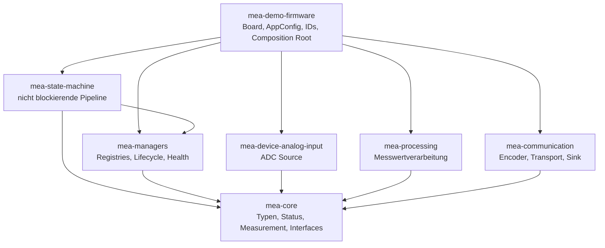
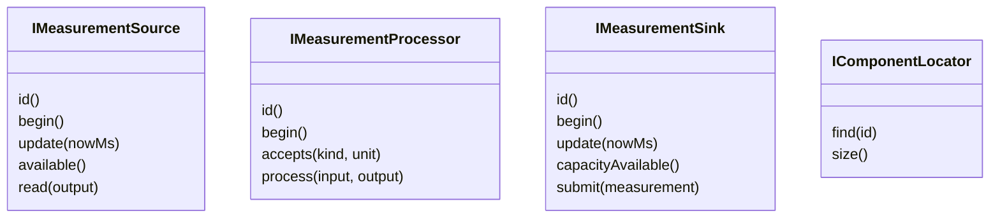
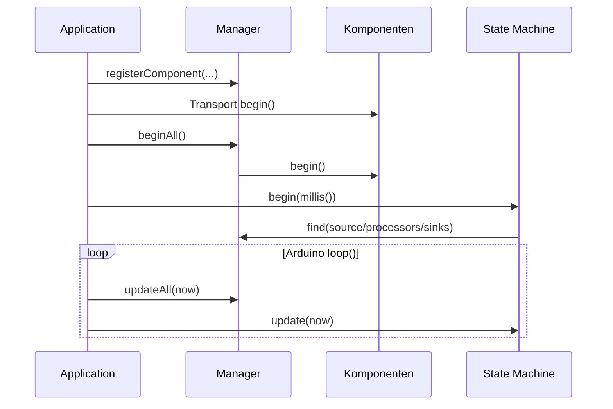

# Architektur

MEA ist als modulare Embedded-Plattform aufgebaut. Jede Library hat eine
begrenzte Verantwortung, eine kleine oeffentliche API und kann separat getestet
und versioniert werden. Die Firmware ist der Composition Root: Dort werden die
konkreten Objekte gebaut, registriert und ueber IDs verbunden.

## Schichten

`mea-core` ist die gemeinsame Sprache. Alles andere haengt daran, aber
`mea-core` haengt an nichts. Dadurch lassen sich fachliche Libraries nativ
testen und auch ausserhalb der Demo-Firmware verwenden.

## Systemprinzipien

| Prinzip | Umsetzung | Sinn |
|---|---|---|
| Composition Root | [Application.cpp](../repositories/mea-demo-firmware/src/Application.cpp) erzeugt und verbindet alles | konkrete Hardware bleibt aus den Libraries heraus |
| Statische Speicherstrategie | feste Arrays, Template-Kapazitaeten, keine Heap-Besitzmodelle | vorhersehbarer RAM-Bedarf |
| Nicht blockierende Updates | `update(nowMs)` in Quellen, Sinks, Transport und Pipeline | kurze Loop, keine versteckten Wartezeiten |
| Status statt Exceptions | [Status.h](../repositories/mea-core/src/mea/core/Status.h) | kleine, triviale Fehlerobjekte mit Herkunft |
| Datenqualitaet statt Kontrollfluss | [Measurement.h](../repositories/mea-core/src/mea/core/Measurement.h) | Werte koennen gueltig transportiert, aber fachlich markiert sein |
| IDs statt direkter Kopplung | [AppIds.h](../repositories/mea-demo-firmware/include/AppIds.h) | State Machine kennt keine konkreten Klassen |

## Datenfluss der Demo

```mermaid
flowchart LR
    GPIO[ESP32 GPIO 34<br/>ADC1_CH6]
    Reader[ArduinoAnalogReader]
    Sensor[AnalogInputSensor<br/>RawAnalog/RawCount]
    Linear[LinearProcessor<br/>Raw -> Volt]
    Clamp[ClampProcessor<br/>0..3.3 V]
    Sink[BufferedMeasurementSink]
    Encoder[CsvMeasurementEncoder]
    Transport[ArduinoStreamTransport]
    Serial[Serial USB]

    GPIO --> Reader --> Sensor --> Linear --> Clamp --> Sink --> Encoder --> Transport --> Serial
```

Die Pipeline-Definition liegt in
[Application.cpp](../repositories/mea-demo-firmware/src/Application.cpp). Die
Parameter stehen in [BoardConfig.h](../repositories/mea-demo-firmware/include/BoardConfig.h)
und [AppConfig.h](../repositories/mea-demo-firmware/include/AppConfig.h).

## Component Interfaces

Diese Interfaces stehen in
[Interfaces.h](../repositories/mea-core/src/mea/core/Interfaces.h). Eine neue
Library wird MEA-kompatibel, indem sie eines dieser Interfaces implementiert und
Statuswerte aus [Status.h](../repositories/mea-core/src/mea/core/Status.h)
zurueckgibt.

## Lebenszyklus

Konstruktoren speichern nur Konfiguration und Referenzen. Hardware-Setup,
Validierung und Puffer-Reset passieren in `begin()`. Die State Machine
initialisiert keine Komponenten; sie loest IDs auf und koordiniert danach den
Ablauf.

## IDs

- `0` ist reserviert: `mea::InvalidComponentId`.
- IDs identifizieren Komponenten innerhalb einer fachlichen Registry.
- Die Pipeline verbindet eine Source, eine geordnete Prozessorliste und eine
  Sinkliste ueber IDs.
- In der Demo liegen die IDs zentral in
  [AppIds.h](../repositories/mea-demo-firmware/include/AppIds.h).

## Speicherstrategie

Manager und State Machine besitzen keine Komponenten. Sie halten Referenzen oder
Pointer auf Objekte, die im Composition Root leben. Puffer sind feste Arrays
oder [RingBuffer](../repositories/mea-core/src/mea/core/RingBuffer.h) mit
Compile-Time-Kapazitaet.

Das bringt:

- keine Heap-Fragmentierung,
- klare Kapazitaetsgrenzen,
- deterministische RAM-Kosten,
- sichtbare Fehler bei Ueberlauf (`CapacityExceeded`, `WouldBlock`).

## Erweiterung

Eine eigene Library ist sinnvoll, wenn ein Modul:

- eine klare Verantwortung besitzt,
- eigenstaendig testbar ist,
- in mehreren Projekten eingesetzt werden kann,
- eine stabile oeffentliche Schnittstelle hat,
- unabhaengig versioniert werden soll.

Kleine Hilfsklassen bleiben in der fachlich passenden Library. Neue
Systemkonzepte oder neue Fehler-/Lifecycle-Regeln werden als ADR dokumentiert.

Weitere Details:

- [07-CODE-TOUR-FUER-TEAMS.md](07-CODE-TOUR-FUER-TEAMS.md)
- [00-VERWENDUNG-UND-KONFIGURATION.md](00-VERWENDUNG-UND-KONFIGURATION.md)
- [ADR-Verzeichnis](adr/)
