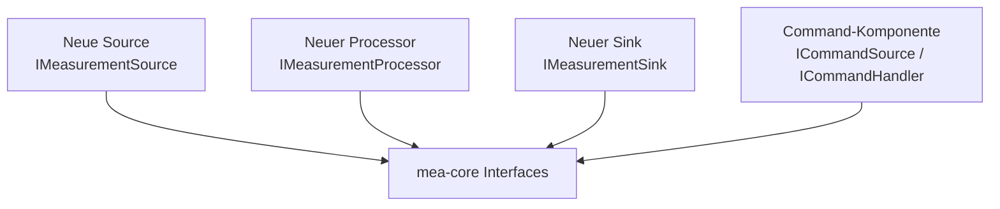

# Neue Library anlegen

Diese Anleitung beschreibt, wie eine neue MEA-Library so angelegt wird, dass
sie einzeln testbar bleibt und sauber in die Demo-Firmware eingebunden werden
kann.

## 1. Vorlage kopieren

```bash
cp -a templates/library-template repositories/mea-device-neuer-sensor
cd repositories/mea-device-neuer-sensor
```

Danach Platzhalter ersetzen:

- `library.json`: Name, Version, Beschreibung, Keywords, Header.
- `src/MeaNewLibrary.h`: Sammel-Header umbenennen.
- `README.md`: Zweck, Abhaengigkeiten, zentrale Dateien, Beispiel.
- `test/`: native Tests fuer das oeffentliche Verhalten.
- `platformio.ini`: direkte `lib_deps` eintragen.

## 2. Rolle bestimmen



Eine Library sollte genau eine fachliche Verantwortung haben. Ein Sensor-Repo
sollte keine Pipeline kennen, ein Processor-Repo keine Pins, ein Communication-
Repo keine ADC-Details.

## 3. Interface waehlen

### Source

```cpp
class MySensor final : public mea::IMeasurementSource {
public:
    mea::ComponentId id() const noexcept override;
    mea::Status begin() noexcept override;
    mea::Status update(mea::TimestampMs nowMs) noexcept override;
    std::size_t available() const noexcept override;
    mea::Status read(mea::Measurement& output) noexcept override;
};
```

Eine Source sammelt Werte in `update()` und liefert sie spaeter ueber
`available()`/`read()` aus.

### Processor

```cpp
class MyProcessor final : public mea::IMeasurementProcessor {
public:
    mea::ComponentId id() const noexcept override;
    mea::Status begin() noexcept override;
    bool accepts(mea::MeasurementKind kind, mea::Unit unit) const noexcept override;
    mea::Status process(const mea::Measurement& input,
                        mea::Measurement& output) noexcept override;
};
```

Ein Processor veraendert Messwerte synchron und blockiert nicht. Fachliche
Einschraenkungen werden ueber `Measurement::quality` sichtbar gemacht, nicht
ueber einen Fehlerstatus, solange die Operation technisch erfolgreich war.

### Sink

```cpp
class MySink final : public mea::IMeasurementSink {
public:
    mea::ComponentId id() const noexcept override;
    mea::Status begin() noexcept override;
    mea::Status update(mea::TimestampMs nowMs) noexcept override;
    std::size_t capacityAvailable() const noexcept override;
    mea::Status submit(const mea::Measurement& measurement) noexcept override;
};
```

Ein Sink uebernimmt Werte in `submit()`. Wenn er keinen Platz hat, gibt er
`WouldBlock` zurueck und verwirft nicht still.

## 4. Konfiguration

Konfigurationen als triviale Strukturen definieren und ueber den Konstruktor
uebergeben:

```cpp
struct Config {
    mea::ComponentId sourceId{mea::InvalidComponentId};
    std::uint8_t address{0};
    mea::TimestampMs intervalMs{1000};
};
```

Regeln:

- Keine Pins, Adressen oder Intervalle hardcoden.
- Konstruktor speichert nur Referenzen und Konfiguration.
- Hardware-Setup und Validierung passieren in `begin()`.
- `update()` macht begrenzte Arbeit und nutzt kein `delay()`.

## 5. Tests schreiben

Fuer Hardware-Libraries zuerst eine kleine HAL definieren, dann einen Fake fuer
native Tests bauen. Muster:

- [../repositories/mea-device-analog-input/src/mea/device/IAnalogReader.h](../repositories/mea-device-analog-input/src/mea/device/IAnalogReader.h)
- [../repositories/mea-device-analog-input/src/mea/device/testing/FakeAnalogReader.h](../repositories/mea-device-analog-input/src/mea/device/testing/FakeAnalogReader.h)

Test ausfuehren:

```bash
pio test -e native
```

## 6. In Demo-Firmware registrieren

1. Dependency in [../repositories/mea-demo-firmware/platformio.ini](../repositories/mea-demo-firmware/platformio.ini) ergaenzen:

```ini
lib_deps =
    mea-device-neuer-sensor=symlink://../mea-device-neuer-sensor
```

2. ID in [../repositories/mea-demo-firmware/include/AppIds.h](../repositories/mea-demo-firmware/include/AppIds.h) anlegen.

3. Objekt in [../repositories/mea-demo-firmware/src/Application.h](../repositories/mea-demo-firmware/src/Application.h) als Member aufnehmen.

4. In [../repositories/mea-demo-firmware/src/Application.cpp](../repositories/mea-demo-firmware/src/Application.cpp) registrieren:

```cpp
sources_.registerComponent(mySensor_);
processors_.registerComponent(myProcessor_);
sinks_.registerComponent(mySink_);
```

5. Pipeline-IDs anpassen:

```cpp
constexpr mea::ComponentId kProcessorIds[] = {
    ids::RawToVoltage,
    ids::MyNewProcessor,
    ids::VoltageClamp,
};
```

## 7. Repository initialisieren

```bash
git init -b main
git add .
git commit -m "chore: initial library scaffold"
```

Danach Remote anlegen und pushen, siehe
[03-GIT-UND-VERSIONIERUNG.md](03-GIT-UND-VERSIONIERUNG.md).

## Review-Checkliste

- README erklaert Zweck, Abhaengigkeiten, zentrale Dateien und Beispiel.
- `library.json` und `Version.h` stimmen ueberein.
- Oeffentliche Header enthalten keine unnoetige Hardware-Abhaengigkeit.
- IDs werden validiert und `InvalidComponentId` wird abgelehnt.
- Fehlerstatus setzt `origin` sinnvoll.
- Native Tests laufen.
- Demo-Firmware baut weiterhin.
