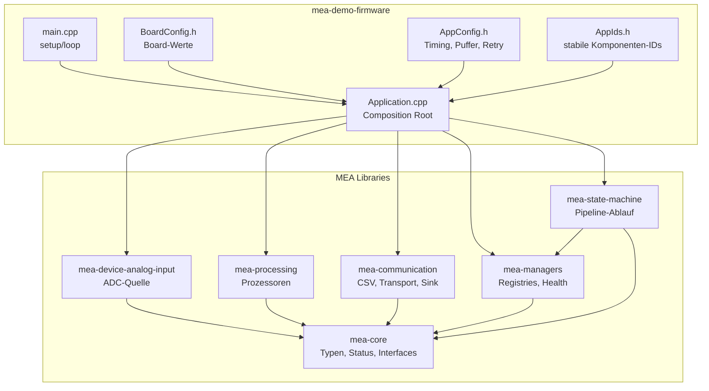
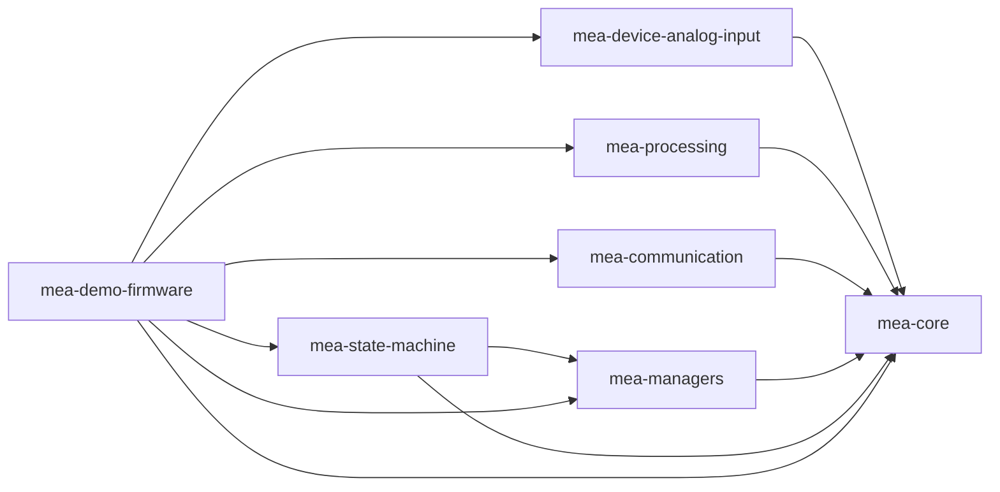
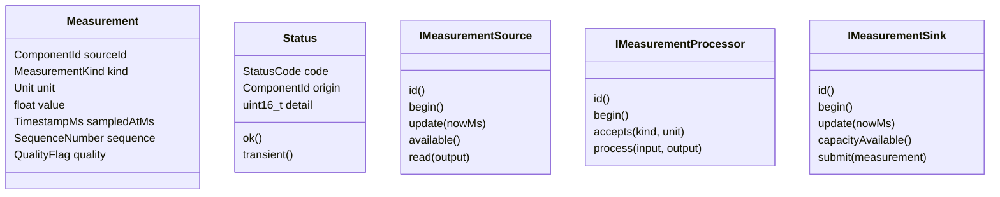
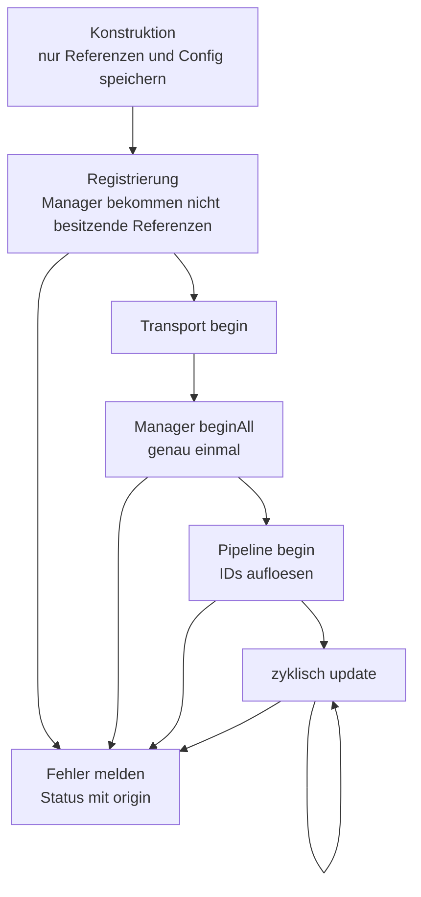
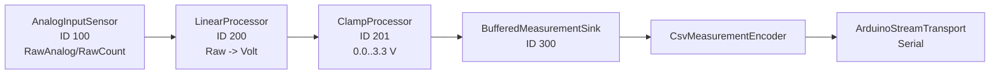
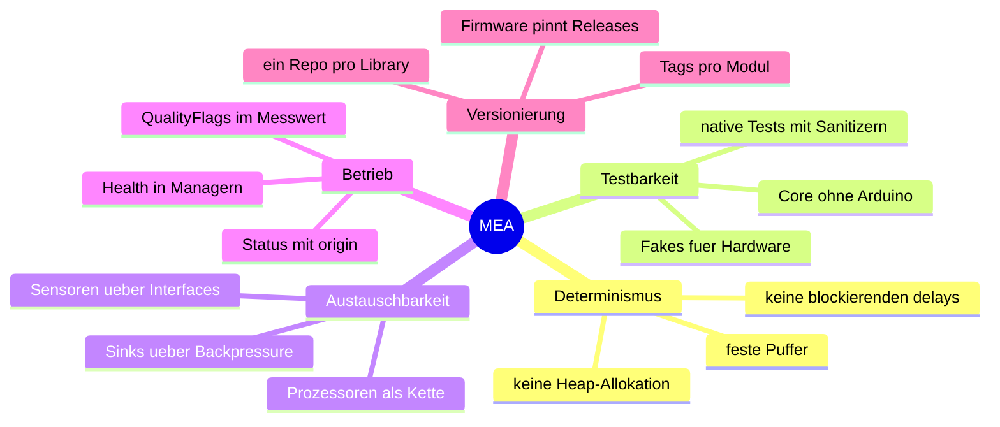

# Code-Tour fuer Teams

Dieses Dokument beschreibt den Code so, wie ich ihn einem Team beim Einstieg
erklaeren wuerde: Welche Bausteine gibt es, warum sind sie getrennt, wie laeuft
ein Messwert durch das System und wie kann man einzelne Repositories separat
verwenden.

Der wichtigste Gedanke: **Die Libraries beschreiben Faehigkeiten, die Firmware
verdrahtet konkrete Objekte.** Dadurch bleiben Sensoren, Verarbeitung,
Kommunikation und State Machine einzeln testbar und einzeln versionierbar.

## System-Sicht



Die Firmware ist bewusst der einzige Ort, an dem konkrete Klassen zusammen
auftauchen. Eine Library wie `mea-processing` weiss nicht, ob ein Wert vom
ESP32-ADC, aus einem Test-Fake oder spaeter aus CAN kommt.

## Einstiegspunkte nach Rolle

| Wenn du ... | Starte hier | Danach |
|---|---|---|
| die Demo flashen willst | [mea-demo-firmware README](../repositories/mea-demo-firmware/README.md) | [wiring.md](../repositories/mea-demo-firmware/docs/wiring.md), [runtime.md](../repositories/mea-demo-firmware/docs/runtime.md) |
| eine Library einzeln nutzen willst | README des jeweiligen Repos | `library.json`, oeffentlicher Sammel-Header |
| neue Messwertlogik schreiben willst | [mea-processing README](../repositories/mea-processing/README.md) | [Interfaces.h](../repositories/mea-core/src/mea/core/Interfaces.h) |
| einen neuen Sensor anbinden willst | [mea-device-analog-input README](../repositories/mea-device-analog-input/README.md) als Muster | [05-NEUE-LIBRARY-ANLEGEN.md](05-NEUE-LIBRARY-ANLEGEN.md) |
| die Pipeline verstehen willst | [mea-state-machine README](../repositories/mea-state-machine/README.md) | [ADR 0005](adr/0005-state-machine-execution.md) |
| das Fehler-/Statusmodell verstehen willst | [Status.h](../repositories/mea-core/src/mea/core/Status.h) | [ADR 0002](adr/0002-status-and-error-model.md) |

## Repository-Abhaengigkeiten



Ein einzelnes Repository kann genutzt werden, solange seine direkten
Abhaengigkeiten vorhanden sind:

| Repo | Benoetigt | Kann alleine sinnvoll genutzt werden fuer |
|---|---|---|
| `mea-core` | nichts | gemeinsame Typen, Interfaces, Test-Fakes, neue Libraries |
| `mea-processing` | `mea-core` | reine Messwertverarbeitung auf PC oder MCU |
| `mea-device-analog-input` | `mea-core` | ADC-Sensorquelle fuer Arduino-kompatible Targets |
| `mea-communication` | `mea-core` | CSV-Ausgabe und zeilenbasierte Commands |
| `mea-managers` | `mea-core` | feste Registries und Health-Diagnose |
| `mea-state-machine` | `mea-core`, `mea-managers` | nicht blockierende Messwert-Pipeline |
| `mea-demo-firmware` | alle MEA-Libraries | Referenzanwendung fuer ESP32 |

## Datenmodell

Ein Messwert ist bewusst klein, kopierbar und ohne Besitzbeziehungen.



Wichtig ist die Trennung:

- `Status` beschreibt, ob eine Operation erfolgreich war.
- `Measurement::quality` beschreibt, ob der Datenwert fachlich eingeschraenkt
  ist, zum Beispiel `OutOfRange` oder `Estimated`.
- Ein Prozessor darf also `Status::Ok` liefern und trotzdem ein Quality-Flag
  setzen. Das ist Absicht und macht Datenqualitaet sichtbar, ohne den
  Kontrollfluss unnoetig abzubrechen.

Relevante Dateien:

- [Measurement.h](../repositories/mea-core/src/mea/core/Measurement.h)
- [Status.h](../repositories/mea-core/src/mea/core/Status.h)
- [Interfaces.h](../repositories/mea-core/src/mea/core/Interfaces.h)

## Laufzeitsequenz

```mermaid
sequenceDiagram
    participant Loop as Arduino loop()
    participant App as Application
    participant Sources as SensorManager
    participant Sensor as AnalogInputSensor
    participant Sinks as SinkManager
    participant Pipe as MeasurementPipelineMachine
    participant Sink as BufferedMeasurementSink
    participant Transport as ArduinoStreamTransport

    Loop->>App: update(millis())
    App->>Sources: updateAll(now)
    Sources->>Sensor: update(now)
    Sensor-->>Sources: Status
    App->>Transport: update(now)
    App->>Sinks: updateAll(now)
    Sinks->>Sink: update(now)
    Sink->>Transport: write(partial frame)
    App->>Pipe: update(now)
    Pipe->>Sensor: available()/read()
    Pipe->>Pipe: processor chain
    Pipe->>Sink: submit(measurement)
```

Die Reihenfolge in [Application.cpp](../repositories/mea-demo-firmware/src/Application.cpp)
ist kein Zufall:

1. Quellen sammeln zuerst neue Werte.
2. Transport/Sinks schreiben alte gepufferte Frames weiter.
3. Die Pipeline holt einen Wert, verarbeitet ihn und uebergibt ihn an Sinks.

So bleibt die Loop kurz, und Backpressure im seriellen Ausgang blockiert nicht
die Messwerterfassung.

## Lebenszyklus



Warum so?

- Konstruktoren koennen keine Hardwarefehler melden. Deshalb initialisiert
  Hardware erst `begin()`.
- Manager besitzen keine Komponenten. Das verhindert versteckte Lebensdauer und
  Heap-Allokation.
- Die State Machine ruft nie `beginAll()` auf. Sie koordiniert nur den Ablauf
  und greift ueber IDs auf bereits initialisierte Komponenten zu.

Details:

- [ADR 0001 Speicher und Besitz](adr/0001-memory-and-ownership.md)
- [ADR 0004 Komponenten-Lebenszyklus](adr/0004-component-lifecycle.md)
- [ComponentManager.h](../repositories/mea-managers/src/mea/managers/ComponentManager.h)

## Demo-Pipeline



Die IDs kommen aus [AppIds.h](../repositories/mea-demo-firmware/include/AppIds.h).
Die Parameter kommen aus:

- [BoardConfig.h](../repositories/mea-demo-firmware/include/BoardConfig.h):
  Pin, ADC-Maximalwert, Referenzspannung, Baudrate.
- [AppConfig.h](../repositories/mea-demo-firmware/include/AppConfig.h):
  Sampling, Oversampling, Queue-Groessen, Timeouts, Retry.
- [Application.cpp](../repositories/mea-demo-firmware/src/Application.cpp):
  konkrete Objektinstanzen und Pipeline-Reihenfolge.

## Standalone-Nutzung einzelner Repos

### Nur `mea-core`

Nutze `mea-core`, wenn du eine neue Library schreiben willst, die sich in MEA
einfuegt. Du implementierst eines der Interfaces aus
[Interfaces.h](../repositories/mea-core/src/mea/core/Interfaces.h) und gibst
ueberall `mea::Status` zurueck.

```cpp
#include <MeaCore.h>

class MyProcessor final : public mea::IMeasurementProcessor {
    // id(), begin(), accepts(), process()
};
```

### Nur `mea-processing`

Nutze `mea-processing`, wenn du Messwerte ohne Hardwareabhaengigkeit umformen,
filtern oder validieren willst.

```cpp
#include <MeaProcessing.h>

mea::LinearProcessor rawToVolt({
    200,
    3.3F / 4095.0F,
    0.0F,
    mea::MeasurementKind::RawAnalog,
    mea::Unit::RawCount,
    mea::MeasurementKind::Voltage,
    mea::Unit::Volt,
});
```

### Nur `mea-communication`

Nutze `mea-communication`, wenn du fertige `Measurement`-Pakete ausgeben willst.
Der Arduino-spezifische Teil ist nur der Transport; Encoder und Sink sind
nativ testbar.

```cpp
#include <MeaCommunication.h>

mea::ArduinoStreamTransport transport(Serial);
mea::CsvMeasurementEncoder encoder({';', 3});
mea::BufferedMeasurementSink<8, 96> sink(transport, encoder, 300);
```

### Nur `mea-state-machine`

Nutze `mea-state-machine`, wenn Source, Prozessoren und Sinks ueber Manager
registriert sind und zyklisch verbunden werden sollen. Die Maschine kennt keine
konkrete Klasse, sondern nur IDs.

```cpp
constexpr mea::ComponentId processors[] = {200, 201};
constexpr mea::ComponentId sinks[] = {300};

mea::PipelineConfig cfg{};
cfg.pipelineId = 400;
cfg.sourceId = 100;
cfg.processorIds = mea::ArrayView<const mea::ComponentId>(processors, 2);
cfg.sinkIds = mea::ArrayView<const mea::ComponentId>(sinks, 1);
```

## Warum diese Architektur sinnvoll ist



Der Nutzen zeigt sich, sobald ein Teil ausgetauscht wird: Ein neuer Sensor
braucht nicht die Pipeline zu kennen, ein neuer Prozessor nicht den ESP32, und
ein neuer Kommunikationsweg nicht die ADC-Details.

## Aenderungsmuster

### Neue Source

1. `IMeasurementSource` implementieren.
2. Eigene Konfigurationsstruktur verwenden, keine Pins hardcoden.
3. Native Tests mit Fake-HAL schreiben.
4. In der Firmware ID vergeben, Objekt erzeugen, registrieren.
5. `PipelineConfig::sourceId` auf die neue ID setzen.

### Neuer Processor

1. `IMeasurementProcessor` implementieren.
2. `accepts(kind, unit)` eng genug definieren.
3. Datenqualitaet per `QualityFlag` ausdruecken, wenn die Operation technisch
   erfolgreich war.
4. ID in `AppIds.h` anlegen.
5. Processor in `kProcessorIds[]` an der richtigen Stelle einreihen.

### Neuer Sink

1. `IMeasurementSink` implementieren.
2. Bei vollem Puffer `WouldBlock` melden, nicht still verwerfen.
3. Falls Transport beteiligt ist: partielle Writes als Normalfall behandeln.
4. ID in `AppIds.h` anlegen und in `kSinkIds[]` aufnehmen.

## Review-Checkliste

- Keine neue Library zieht `Arduino.h`, wenn sie fachlich nativ testbar bleiben
  soll.
- Keine dynamische Allokation in zyklischem Code.
- Jede Komponente hat eine stabile, nicht-null ID.
- `begin()` validiert Konfiguration und ist der einzige Hardware-Setup-Ort.
- `update()` blockiert nicht und macht begrenzte Arbeit.
- Fehlerstatus enthaelt eine sinnvolle `origin`.
- Datenqualitaet wird nicht als Fehlerstatus missbraucht.
- Neue oeffentliche API ist in README und gegebenenfalls ADR dokumentiert.
