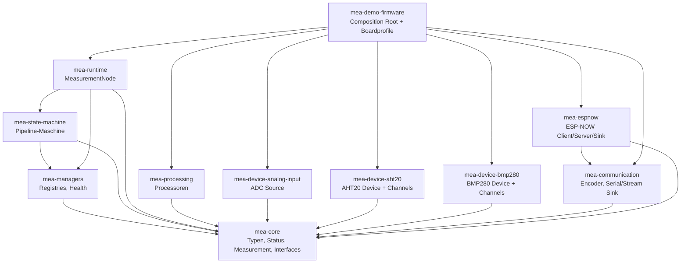
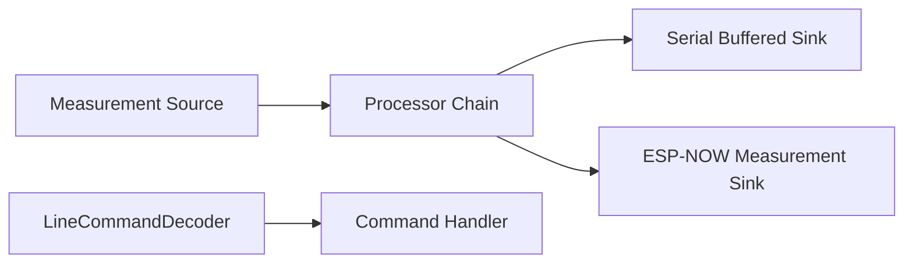

# 08 - Umbauplan fuer eine modulare MEA-Einheit

Stand: 2026-07-19

Dieses Dokument beschreibt den naechsten Umbau der MEA-Repositories. Ziel ist,
dass die Repositories nicht nur einzeln sauber sind, sondern zusammen wie eine
einheitliche Plattform funktionieren: einfache Verdrahtung in der Firmware,
klare Modulgrenzen, reproduzierbare Builds und ein logischer Weg fuer neue
Sensoren, Ausgaben und Knotenvarianten.

## 1. Zielbild

MEA soll als Baukastensystem funktionieren:

- `mea-core` definiert die gemeinsame Sprache.
- Device-Repos liefern konkrete Messquellen oder Hardwaredienste.
- `mea-processing` veraendert Messwerte ohne Hardwarewissen.
- Kommunikations-Repos liefern Sinks, Encoder und Transportwege.
- `mea-managers` verwaltet Komponenten ohne Besitzuebernahme.
- `mea-state-machine` fuehrt Messwert-Pipelines aus.
- `mea-runtime` ist die zentrale Runtime-Fassade fuer Knoten.
- `mea-demo-firmware` ist nur noch Composition Root und Board-Profil.

Der wichtigste Architekturwechsel ist:

```text
Vorher:
Application.cpp registriert Manager, ruft beginAll(), updateAll(),
Transport-Update und Pipeline-Update selbst auf.

Nachher:
Application.cpp besitzt konkrete Objekte und beschreibt nur die Verdrahtung.
MeasurementNode uebernimmt Registrierung, Lebenszyklus, Updates und Diagnose.
```

## 2. Verbindliche Designregeln

1. `mea-core` bleibt hardwarefrei und haengt von keinem anderen MEA-Repo ab.
2. Libraries kennen keine konkrete Firmware, keine Pins und keine App-IDs.
3. Der Composition Root besitzt alle Objekte mit statischer Lebensdauer.
4. Manager, Runtime und State Machine besitzen keine Komponenten.
5. Kommunikation, Sensoren und Processing sprechen nur ueber `Measurement`,
   `Status`, IDs und Interfaces.
6. `update(nowMs)` bleibt nicht blockierend und leistet begrenzte Arbeit.
7. Keine zyklischen Repo-Abhaengigkeiten.
8. Neue Features werden zuerst als eigenstaendige Library oder als Runtime-
   Erweiterung eingeordnet, nicht spontan in die Demo kopiert.
9. Jede neue Library bekommt eigene native Tests, README, `library.json`,
   `platformio.ini` und eine Version.
10. Die Demo darf mehrere Profile haben, aber jedes Profil muss klar benannt
    und baubar sein.

## 3. Ziel-Abhaengigkeiten



Regel: Kein Pfeil darf zurueck nach oben zeigen. Besonders wichtig:
Device-Repos duerfen nicht von `mea-runtime`, `mea-managers` oder
`mea-state-machine` abhaengen.

## 4. Repo-Rollen

| Repo | Rolle nach dem Umbau | Darf kennen | Darf nicht kennen |
|---|---|---|---|
| `mea-core` | stabile Plattform-API | Standard-C++ | Arduino, ESP32, andere MEA-Repos |
| `mea-managers` | Registries und Health | `mea-core` | konkrete Sensoren, Firmware |
| `mea-state-machine` | Pipeline-Ausfuehrung | `mea-core`, `mea-managers` | konkrete Sensoren, Serial, ESP-NOW |
| `mea-runtime` | einfache Knoten-Fassade | `mea-core`, `mea-managers`, `mea-state-machine` | Board-Pins, konkrete App-IDs |
| `mea-processing` | fachliche Verarbeitung | `mea-core` | Hardware, Runtime |
| `mea-device-analog-input` | ADC-Quelle | `mea-core`, Arduino nur im HAL-Treiber | Runtime, Manager |
| `mea-device-aht20` | I2C-Device + Temp/Humidity-Quellen | `mea-core`, Arduino nur im Treiber | Runtime, Manager |
| `mea-device-bmp280` | I2C-Device + Temp/Pressure-Quellen | `mea-core`, Arduino nur im Treiber | Runtime, Manager |
| `mea-communication` | Encoder, Byte-Transport, Serial-Sink | `mea-core`, Arduino nur im Transport | Sensoren, Runtime |
| `mea-espnow` | Funktransport und Funk-Sink | `mea-core`, `mea-communication`, ESP32 nur im Radio | Demo, Sensoren |
| `mea-demo-firmware` | konkrete Produkte/Knoten | alle benoetigten Libraries | wiederverwendbare Fachlogik |

## 5. Neuer Firmware-Aufbau

`mea-demo-firmware` soll mehrere klare Knotenprofile bekommen. Ein Profil ist
eine konkrete Verdrahtung aus Sensoren, Prozessoren und Sinks.

Empfohlene Struktur:

```text
repositories/mea-demo-firmware/
  include/
    AppIds.h
    BoardConfig.h
    profiles/
      AnalogSerialProfile.h
      I2cSerialProfile.h
      EspNowClientProfile.h
      EspNowServerProfile.h
  src/
    Application.cpp
    Application.h
    main.cpp
```

`Application` soll nur ein Profil auswaehlen und treiben:

```cpp
void Application::begin() {
    Serial.begin(board::kSerialBaudRate);
    profile_.configure(node_);
    const mea::Status status = node_.begin(millis());
    healthy_ = status.ok();
}

void Application::update(mea::TimestampMs nowMs) {
    if (healthy_) {
        (void)node_.update(nowMs);
    }
}
```

Die konkrete Objekt-Erzeugung bleibt statisch im Profil oder in `Application`.
Die Verdrahtung laeuft ueber `MeasurementNode`:

```cpp
node_.setReporter(&Application::reportStatus);
node_.setDefaultTuning({
    config::kPipelineCycleIntervalMs,
    config::kAcquisitionTimeoutMs,
    config::kPublishTimeoutMs,
    config::kRetryPolicy,
    config::kStartImmediately,
});

node_.addDevice(serialTransport);
node_.addPipeline(ids::SoilVoltagePipeline, analogSensor)
    .through(rawToVoltage, voltageClamp)
    .into(serialSink);
```

## 6. PlatformIO-Profile

Die Demo soll nicht mehr nur `esp32dev` als ein einziges Ziel kennen.

Ziel-Umgebungen:

| Environment | Zweck | benoetigte Repos |
|---|---|---|
| `native` | Host-Integrationstests | Core, Runtime, Processing, Communication, Device-Fakes |
| `esp32dev_analog_serial` | ADC -> Serial CSV | Core, Runtime, Analog, Processing, Communication |
| `esp32dev_i2c_serial` | AHT20/BMP280 -> Serial CSV | Core, Runtime, AHT20, BMP280, Processing, Communication |
| `esp32dev_espnow_client` | Sensor-Node -> ESP-NOW | Core, Runtime, Sensoren, Processing, Communication, ESP-NOW |
| `esp32dev_espnow_server` | ESP-NOW Empfaenger -> Serial | Core, Communication, ESP-NOW |
| `esp32dev_test` | Embedded-Smoke | minimale Hardware-Compile-Pruefung |

Umsetzung:

1. `lib_deps` in `mea-demo-firmware/platformio.ini` um `mea-runtime`,
   `mea-device-aht20`, `mea-device-bmp280` und `mea-espnow` erweitern.
2. Pro Profil ein Build-Flag setzen, z. B. `-DMEA_PROFILE_ANALOG_SERIAL`.
3. `Application.h` bindet anhand des Build-Flags genau ein Profil ein.
4. Jedes Profil muss allein kompilieren.

## 7. Zentrale Repo-Liste

Aktuell kennen einige Skripte nur die alte Repo-Menge. Das muss vereinheitlicht
werden, sonst funktionieren neue Module lokal, aber nicht in Git, CI, Tests und
Release.

Neue Datei:

```text
scripts/repos.sh
```

Inhalt:

```bash
MEA_REPOS=(
  mea-core
  mea-managers
  mea-state-machine
  mea-runtime
  mea-processing
  mea-device-analog-input
  mea-device-aht20
  mea-device-bmp280
  mea-communication
  mea-espnow
  mea-demo-firmware
)
```

Alle Skripte muessen diese Datei laden:

- `init-repositories.sh`
- `create-gitea-repositories.sh`
- `configure-remotes.sh`
- `create-bare-remotes.sh`
- `push-all.sh`
- `test-all.sh`
- `build-all.sh`
- `verify-all.sh`

Akzeptanzkriterium:

```bash
./scripts/init-repositories.sh
./scripts/test-all.sh
./scripts/build-all.sh
```

laeuft ueber alle 11 Repos bzw. alle relevanten Build-Profile.

## 8. Git-Struktur

Der Workspace ist ein Meta-Repository und enthaelt Dokumentation, Skripte,
Templates und einen Quellcode-Snapshot. Die eigentlichen Libraries sollen
zusaetzlich eigene Git-Repos unter `repositories/` sein.

Offener Umbau:

1. `mea-device-aht20` als eigenes Repo initialisieren.
2. `mea-device-bmp280` als eigenes Repo initialisieren.
3. `mea-espnow` als eigenes Repo initialisieren.
4. `mea-runtime` als eigenes Repo initialisieren.
5. Remotes in Gitea/Forgejo fuer alle 11 Repos erstellen.
6. `push-all.sh` fuer alle 11 Repos nutzen.

Wichtig: Keine geheimen Tokens in Dateien speichern. Token nur als
`GITEA_TOKEN` im Terminal setzen und danach wieder entfernen.

## 9. Runtime-Refactor

`MeasurementNode` ist der zentrale Integrationspunkt. Er soll die einfache API
bleiben, mit der neue Knoten gebaut werden.

### 9.1 Demo auf Runtime umstellen

Dateien:

- `repositories/mea-demo-firmware/src/Application.h`
- `repositories/mea-demo-firmware/src/Application.cpp`
- `repositories/mea-demo-firmware/test/native/test_integration/main.cpp`

Schritte:

1. Manuelle Manager-Member in `Application` entfernen.
2. Manuelle `MeasurementPipelineMachine` in `Application` entfernen.
3. `mea::MeasurementNode<...> node_` als Runtime-Member einfuehren.
4. `begin()` auf `node_.begin(millis())` reduzieren.
5. `update()` auf `node_.update(nowMs)` reduzieren.
6. Bestehende Integrationstests anpassen, sodass sie die neue Runtime-
   Verdrahtung pruefen.

Ergebnis: Neue Sensoren/Sinks werden nicht mehr durch wiederholten Manager-
Boilerplate eingebaut, sondern durch deklarative Pipeline-Zeilen.

### 9.2 Device-Abhaengigkeiten modellieren

Problem: Quellen wie AHT20/BMP280 haengen an einem `IDevice`. Sinks wie
ESP-NOW haengen indirekt an `EspNowClient`. Die Runtime initialisiert Devices,
aber Pipelines wissen noch nicht ausdruecklich, welche Devices fuer sie kritisch
sind.

Erweiterung:

```cpp
node.addPipeline(ids::TemperaturePipeline, aht20Temperature)
    .requires(aht20Device)
    .through(...)
    .into(serialSink);
```

Regel:

- Wenn ein required Device bei `begin()` fehlschlaegt, wird nur diese Pipeline
  deaktiviert.
- Wenn ein nicht-kritischer Sink temporaer nicht bereit ist, bleibt die Pipeline
  aktiv.
- Kritische Programmierfehler wie doppelte IDs bleiben strikt.

### 9.3 Diagnose vereinheitlichen

Ergaenzen:

- `MeasurementNode::deviceCount()`
- `MeasurementNode::sourceCount()`
- `MeasurementNode::sinkCount()`
- `MeasurementNode::deviceHealth(index/id)`
- optional `MeasurementNode::pipelineHealth(id)`

Ziel: Die Demo und spaetere Monitoring-Sinks muessen nicht in einzelne Manager
hineingreifen.

## 10. Sensor-Refactor

AHT20 und BMP280 zeigen dasselbe Grundmuster:

- ein gemeinsames `Device` treibt den Chip,
- mehrere `Sensor`-Kanäle lesen das letzte Sample,
- jeder Kanal hat eigene ID, Queue und Sequenznummer,
- volle Queue fuehrt zu dokumentierter Drop-Policy.

Kurzfristig bleibt der Code getrennt. Das ist lesbar und risikoarm.

Sobald ein dritter I2C-Mehrkanal-Sensor dazukommt, wird ein gemeinsames Muster
eingefuehrt:

```text
mea-device-common/
  MultiChannelSampleDevice.h
  ChannelMeasurementSource.h
```

Nicht in `mea-core` verschieben. `mea-core` soll Vertrag bleiben, nicht
Sensor-Hilfsbibliothek.

Akzeptanzkriterium fuer neue Sensoren:

1. Native Tests mit Fake-Driver.
2. Kein Arduino-Header im testbaren Kern.
3. Arduino-Abhaengigkeit nur im konkreten Treiber hinter `#ifdef ARDUINO`.
4. Source implementiert `IMeasurementSource`.
5. Shared Chip implementiert `IDevice`.

## 11. Kommunikations-Refactor

Die Schichtung ist bereits gut:

```text
IByteTransport -> IMeasurementEncoder -> IMeasurementSink
```

Ausbauen sollte man:

1. `TextMeasurementEncoder` und `CsvMeasurementEncoder` als gleichwertige
   Ausgabeformate dokumentieren.
2. ESP-NOW-Sink als normalen `IMeasurementSink` in Demo-Profile aufnehmen.
3. Eingehende Kommandos ueber `LineCommandDecoder` in Runtime oder eigenes
   Command-Modul integrieren.

Zielbild:



## 12. Command-Pfad

`mea-core` enthaelt bereits Command-Interfaces. Der naechste logische Schritt
ist ein einheitlicher Command-Pfad.

Option A: In `mea-runtime` integrieren.

- Vorteil: Ein Knoten hat eine Fassade fuer Messwerte und Befehle.
- Nachteil: Runtime wird groesser.

Option B: Neues Repo `mea-commands`.

- Vorteil: Command-Logik bleibt getrennt.
- Nachteil: ein weiteres Repo, mehr Governance-Aufwand.

Empfehlung: Erst klein in `mea-runtime` integrieren. Wenn daraus komplexe
Protokoll- oder Routinglogik entsteht, spaeter extrahieren.

Minimaler API-Vorschlag:

```cpp
node.addCommandSource(serialCommandDecoder);
node.addCommandHandler(commandHandler);
```

`node.update(nowMs)` treibt dann:

1. Devices
2. Measurement Sources
3. Sinks
4. Pipelines
5. Command Sources
6. Command Handlers

## 13. Konfigurationsmodell

`BoardConfig.h`, `AppConfig.h` und `AppIds.h` sind richtig, muessen aber fuer
mehrere Profile sauber getrennt werden.

Ziel:

```text
include/
  BoardConfig.h              globale Boardwerte
  AppIds.h                   globale ID-Bereiche
  profiles/
    AnalogSerialConfig.h
    I2cSerialConfig.h
    EspNowClientConfig.h
    EspNowServerConfig.h
```

ID-Bereiche:

| Bereich | Zweck |
|---|---|
| 100-199 | Sources |
| 200-299 | Processors |
| 300-399 | Sinks |
| 400-499 | Pipelines |
| 500-599 | Devices |
| 600-699 | Command Sources |
| 700-799 | Command Handlers |

Regel: IDs sind pro Firmware stabil. Libraries liefern keine App-IDs.

## 14. Dokumentations-Refactor

Aktuelle Doku muss das neue Zielbild spiegeln.

Anpassen:

- `README.md`: Schnellstart um neue Profile ergaenzen.
- `docs/00-VERWENDUNG-UND-KONFIGURATION.md`: Profile, Runtime und ESP-NOW
  aufnehmen.
- `docs/02-ARCHITEKTUR.md`: Diagramm auf 11 Repos erweitern.
- `docs/03-GIT-UND-VERSIONIERUNG.md`: nicht mehr "sieben Repositories",
  sondern zentrale Repo-Liste.
- `docs/04-TESTS-UND-QUALITAET.md`: `test-all.sh`/`build-all.sh` fuer alle
  aktuellen Module beschreiben.
- `docs/05-NEUE-LIBRARY-ANLEGEN.md`: Einbindung ueber `MeasurementNode`
  statt manuelles Manager-Boilerplate.
- `docs/06-PRODUCTION-ROADMAP.md`: deutlich als historisches Archiv markieren.
- `docs/07-CODE-TOUR-FUER-TEAMS.md`: Runtime, AHT20, BMP280 und ESP-NOW in
  den Hauptfluss aufnehmen.

## 15. Phasenplan

### Phase 1 - Repo-Liste und Skripte stabilisieren

Ziel: Alle Werkzeuge kennen dieselbe Wahrheit.

Arbeit:

1. `scripts/repos.sh` anlegen.
2. Alle Skripte auf `MEA_REPOS` umstellen.
3. Neue Repos initialisieren, falls `.git` fehlt.
4. Gitea-Skripte auf alle 11 Repos testen.
5. `README.md` und Git-Doku korrigieren.

Abnahme:

```bash
bash -n scripts/*.sh
./scripts/test-all.sh
```

### Phase 2 - Demo auf `MeasurementNode` umstellen

Ziel: Die Demo nutzt die Runtime, die genau fuer diese Vereinfachung gebaut
wurde.

Arbeit:

1. `mea-runtime` in `mea-demo-firmware/platformio.ini` eintragen.
2. `Application` von Manager-/Pipeline-Boilerplate befreien.
3. `MeasurementNode` als einzige Runtime-Instanz nutzen.
4. Bestehende Analog-Serial-Pipeline unveraendert nachbauen.
5. Native Integrationstests anpassen.

Abnahme:

```bash
cd repositories/mea-demo-firmware
pio test -e native
pio run -e esp32dev
```

### Phase 3 - Profile einfuehren

Ziel: Mehrere sinnvolle Firmware-Ziele statt einer wachsenden Demo-Datei.

Arbeit:

1. Profilordner unter `include/profiles/` anlegen.
2. `AnalogSerialProfile` aus aktueller Demo extrahieren.
3. `I2cSerialProfile` mit AHT20/BMP280 bauen.
4. `EspNowClientProfile` bauen.
5. `EspNowServerProfile` bauen.
6. `platformio.ini` Build-Flags pro Profil setzen.

Abnahme:

```bash
pio run -e esp32dev_analog_serial
pio run -e esp32dev_i2c_serial
pio run -e esp32dev_espnow_client
pio run -e esp32dev_espnow_server
```

### Phase 4 - Runtime-Abhaengigkeiten und Diagnose

Ziel: Ausfaelle werden sauber auf betroffene Pipelines begrenzt.

Arbeit:

1. `PipelineBuilder::requires(IDevice&)` einfuehren.
2. Runtime merkt Device-Abhaengigkeiten pro Pipeline.
3. Pipeline wird deaktiviert, wenn required Device nicht startet.
4. Diagnosezugriffe fuer Devices, Sources, Sinks und Pipelines ergaenzen.
5. Tests fuer Teilausfall schreiben.

Abnahme:

```bash
cd repositories/mea-runtime
pio test -e native
```

### Phase 5 - Command-Pfad integrieren

Ziel: Eingehende Kommunikation wird nicht laenger nur vorbereitet, sondern
wirklich durch die Runtime getrieben.

Arbeit:

1. Command Sources und Handler in `MeasurementNode` aufnehmen.
2. `LineCommandDecoder` in Serial-Profil verdrahten.
3. Ein einfacher Handler: Status ausgeben, Pipeline aktivieren/deaktivieren.
4. Tests fuer gueltige/ungueltige Kommandos.

Abnahme:

```bash
cd repositories/mea-runtime
pio test -e native
cd ../mea-demo-firmware
pio test -e native
```

### Phase 6 - Doku und Team-Onboarding aktualisieren

Ziel: Dokumentation beschreibt den aktuellen Code, nicht die alte Migration.

Arbeit:

1. Architekturdiagramme aktualisieren.
2. Code-Tour auf Runtime-Profile ausrichten.
3. Neue-Library-Doku auf `MeasurementNode` umstellen.
4. Git-Doku auf 11 Repos und zentrale Repo-Liste umstellen.
5. README-Schnellstart fuer Profile ergaenzen.

Abnahme:

```bash
rg -n "sieben Repositories|SerialCsvSink|main.cpp.*Composition Root" docs README.md
```

Nur historische Dokumente duerfen alte Begriffe noch enthalten.

### Phase 7 - Releasefaehigkeit

Ziel: Alle Repos koennen einzeln getaggt und reproduzierbar eingebunden werden.

Arbeit:

1. Versionen in `library.json` und `Version.h` pruefen.
2. `CHANGELOG.md` je Repo anlegen oder aktualisieren.
3. Git-Tags fuer kompatible Versionen setzen.
4. Release-Variante der `lib_deps` mit Git-URLs dokumentieren.
5. CI-Vorlage fuer Gitea Actions aktualisieren.

Abnahme:

```bash
./scripts/verify-all.sh
git -C repositories/mea-core tag --list
```

## 16. Konkrete Akzeptanzkriterien fuer den Gesamtumbau

Der Umbau gilt als fertig, wenn:

1. Alle 11 Repos in Skripten, Doku und Gitea konsistent auftauchen.
2. Jedes Library-Repo eigene native Tests hat.
3. `mea-demo-firmware` nutzt `mea-runtime`.
4. `Application.cpp` enthaelt keine direkte Manager- oder
   `MeasurementPipelineMachine`-Verdrahtung mehr.
5. Alle Demo-Profile bauen.
6. ESP-NOW kann als normaler Sink in einer Messpipeline verwendet werden.
7. AHT20/BMP280 laufen als Shared-Device plus Kanal-Sources.
8. Keine Library ausser der Demo kennt App-IDs oder Board-Pins.
9. `./scripts/verify-all.sh` laeuft lokal durch.
10. Architektur-Doku, Code-Tour und README zeigen dasselbe Zielbild.

## 17. Risiken und Gegenmassnahmen

| Risiko | Gegenmassnahme |
|---|---|
| Demo wird durch zu viele Profile unuebersichtlich | Profile in eigene Header auslagern |
| Runtime wird zu maechtig | Nur Lebenszyklus, Routing und Diagnose aufnehmen; Fachlogik bleibt in Libraries |
| Neue Sensoren erzeugen Duplikate | Common-Abstraktion erst ab drittem Wiederholungsmuster |
| ESP-NOW verhaelt sich anders als Serial | Unterschiedliche Drop-/Backpressure-Policy explizit dokumentieren |
| Multi-Repo-Skripte driften wieder | Eine zentrale `scripts/repos.sh` als einzige Repo-Liste |
| Doku widerspricht Code | Nach jeder Phase gezielt nach alten Begriffen suchen |

## 18. Empfohlene Arbeitsreihenfolge fuer Commits

1. `chore(workspace): centralize repository list`
2. `chore(workspace): include runtime and wireless modules in scripts`
3. `refactor(demo): wire analog serial profile through MeasurementNode`
4. `feat(demo): add build profiles for analog i2c and espnow`
5. `feat(runtime): model required devices per pipeline`
6. `feat(runtime): add command source and handler dispatch`
7. `docs(workspace): update architecture for eleven repositories`
8. `chore(release): align versions changelogs and verification`

## 19. Kurzfazit

Der Code ist nicht das Hauptproblem. Die Grundlagen sind stark: kleine
Interfaces, native Tests, feste Speicherstrategie und saubere Trennung zwischen
Hardware und Fachlogik.

Der eigentliche Umbau ist ein Integrationsumbau:

- `MeasurementNode` muss die aktive Verdrahtungsstelle werden.
- Die Demo muss in klare Profile zerlegt werden.
- Die Skripte muessen alle aktuellen Repos kennen.
- Die Doku muss wieder dieselbe Wahrheit erzaehlen wie der Code.

Wenn diese vier Punkte erledigt sind, funktioniert MEA deutlich staerker als
eine modulare Einheit: neue Sensoren und neue Ausgaben werden dann nicht mehr
als Sonderfall eingebaut, sondern folgen einem einfachen, wiederholbaren Muster.
