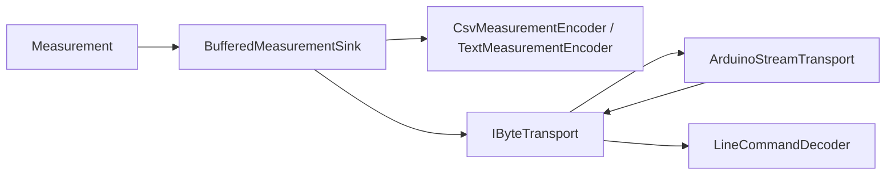

# MEA Communication

`mea-communication` ist die kabelgebundene Kommunikationsschicht der
MEA-Plattform. Sie trennt Transport, Kodierung, Sink-Verhalten und vorbereitete
eingehende Kommandos.

Zielstand nach Umbauplan:
[../../docs/08-UMBAUPLAN-MODULARE-EINHEIT.md](../../docs/08-UMBAUPLAN-MODULARE-EINHEIT.md).

## Rolle im Zielsystem



## Zielnutzung mit Runtime

```cpp
mea::ArduinoStreamTransport serialTransport(Serial);
mea::CsvMeasurementEncoder csv({';', 3});
mea::BufferedMeasurementSink<8, 96> serialSink(
    serialTransport,
    csv,
    ids::SerialOutput);

node.addDevice(serialTransport);
node.addPipeline(ids::SoilVoltagePipeline, analogSensor)
    .through(rawToVoltage, voltageClamp)
    .into(serialSink);
```

## Schichten

| Schicht | Typ | Aufgabe |
|---|---|---|
| Transport | `IByteTransport` | Bytes lesen/schreiben, nicht blockierend |
| Arduino-Adapter | `ArduinoStreamTransport` | `Serial` oder anderer Arduino-`Stream` |
| Encoder | `IMeasurementEncoder` | `Measurement` in Bytes wandeln |
| Ausgabe | `BufferedMeasurementSink` | Queue, Backpressure, partielles Schreiben |
| Eingang | `LineCommandDecoder` | zeilenbasierte Kommandos vorbereiten |

## CSV-Format

```text
version;source_id;kind;unit;value;sampled_at_ms;sequence;quality
```

Beispiel:

```text
1;100;2;2;1.650;12345;42;0
```

Das Format ist bewusst numerisch und versionsmarkiert, damit kleine Empfaenger
es einfach parsen koennen.

## Backpressure-Regel

`BufferedMeasurementSink::submit()` darf `WouldBlock` liefern, wenn die Queue
voll ist. Der Wert wird dann nicht uebernommen. Die State Machine entscheidet
ueber Retry und Timeout.

## Command-Zielstand

`LineCommandDecoder` soll im Runtime-Refactor als `ICommandSource` verdrahtet
werden. Dadurch kann die Demo spaeter Kommandos wie Statusausgabe,
Pipeline-Aktivierung oder Profilsteuerung empfangen, ohne die Messpipeline zu
vermischen.

## Zentrale Dateien

| Datei | Verantwortung |
|---|---|
| [src/MeaCommunication.h](src/MeaCommunication.h) | Sammel-Header |
| [src/mea/communication/IByteTransport.h](src/mea/communication/IByteTransport.h) | Transport-Interface |
| [src/mea/communication/ArduinoStreamTransport.h](src/mea/communication/ArduinoStreamTransport.h) | Arduino-Transport |
| [src/mea/communication/IMeasurementEncoder.h](src/mea/communication/IMeasurementEncoder.h) | Encoder-Interface |
| [src/mea/communication/CsvMeasurementEncoder.h](src/mea/communication/CsvMeasurementEncoder.h) | maschinenlesbares CSV |
| [src/mea/communication/TextMeasurementEncoder.h](src/mea/communication/TextMeasurementEncoder.h) | menschenlesbarer Text |
| [src/mea/communication/BufferedMeasurementSink.h](src/mea/communication/BufferedMeasurementSink.h) | gepufferter Sink |
| [src/mea/communication/LineCommandDecoder.h](src/mea/communication/LineCommandDecoder.h) | Command-Eingang |

## Abhaengigkeiten

| Dependency | Warum |
|---|---|
| [../mea-core](../mea-core) | `Measurement`, `Status`, Sink- und Command-Interfaces |

## Testen

```bash
pio test -e native
```
