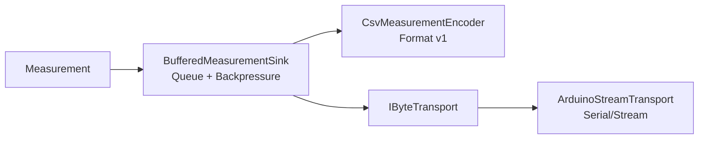
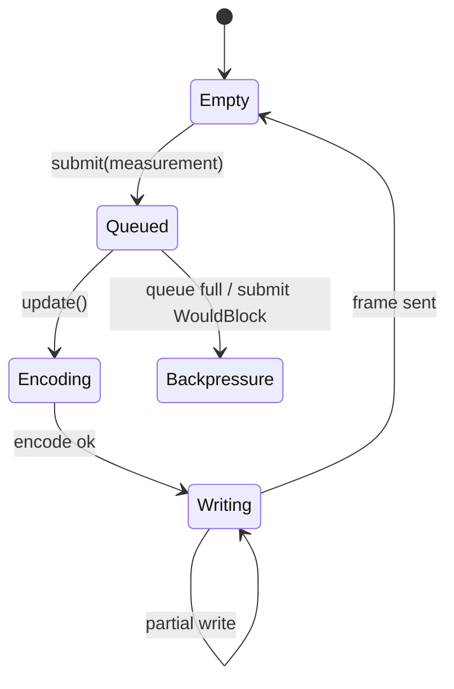

# MEA Communication

`mea-communication` enthaelt die Kommunikationsschicht fuer MEA-Messwerte und
vorbereitete eingehende Kommandos. Die Library trennt Transport, Kodierung und
Sink-Logik, damit Arduino-Abhaengigkeit, CSV-Format und Backpressure getrennt
testbar bleiben.

## Wofuer diese Library gedacht ist

Nutze diese Library, wenn du:

- `mea::Measurement` als CSV ausgeben willst,
- einen nicht blockierenden Sink mit fester Queue brauchst,
- einen Byte-Transport abstrahieren willst,
- spaeter einfache zeilenbasierte Kommandos empfangen willst.

## Schichten



## Abhaengigkeiten

| Dependency | Warum |
|---|---|
| [../mea-core](../mea-core) | `Measurement`, `Status`, `IMeasurementSink`, `Command` |

Nur `ArduinoStreamTransport` benoetigt Arduino. Encoder, Sink und
`LineCommandDecoder` sind nativ testbar.

## Zentrale Dateien

| Datei | Rolle |
|---|---|
| [src/MeaCommunication.h](src/MeaCommunication.h) | Sammel-Header |
| [src/mea/communication/IByteTransport.h](src/mea/communication/IByteTransport.h) | nicht blockierender Byte-Transport |
| [src/mea/communication/ArduinoStreamTransport.h](src/mea/communication/ArduinoStreamTransport.h) | Arduino-`Stream` als Transport |
| [src/mea/communication/IMeasurementEncoder.h](src/mea/communication/IMeasurementEncoder.h) | Encoder-Interface |
| [src/mea/communication/CsvMeasurementEncoder.h](src/mea/communication/CsvMeasurementEncoder.h) | CSV-Encoder |
| [src/mea/communication/BufferedMeasurementSink.h](src/mea/communication/BufferedMeasurementSink.h) | gepufferter Sink mit Backpressure |
| [src/mea/communication/LineCommandDecoder.h](src/mea/communication/LineCommandDecoder.h) | zeilenbasierter Command-Decoder |
| [src/mea/communication/testing/FakeByteTransport.h](src/mea/communication/testing/FakeByteTransport.h) | Fake fuer native Tests |

## CSV-Format

```text
version;source_id;kind;unit;value;sampled_at_ms;sequence;quality
```

Beispiel:

```text
1;100;2;2;1.650;12345;42;0
```

`kind`, `unit` und `quality` werden numerisch geschrieben. Das erste Feld ist
die Formatversion, damit Parser spaeter sauber migriert werden koennen.

## Backpressure



Wenn die Queue voll ist, gibt `submit()` `WouldBlock` zurueck. Der Wert wird
nicht still verworfen. Die Pipeline kann darauf mit Retry und Timeout reagieren.

## Standalone-Nutzung

```ini
lib_deps =
    mea-core=symlink://../mea-core
    mea-communication=symlink://../mea-communication
```

```cpp
#include <MeaCommunication.h>

mea::ArduinoStreamTransport transport(Serial);
mea::CsvMeasurementEncoder encoder({';', 3});
mea::BufferedMeasurementSink<8, 96> sink(transport, encoder, 300);

transport.begin();
sink.begin();
sink.submit(measurement);
sink.update(millis());
```

## Eingehende Kommandos

`LineCommandDecoder` ist vorbereitet, aber in der Demo-Firmware noch nicht
verdrahtet. Format:

```text
target_id;command_type;argument
```

Beispiel:

```text
100;1;0
```

Ungueltige oder zu lange Zeilen werden verworfen und ueber
`protocolErrors()` sichtbar.

## Testen

```bash
pio test -e native
```

## Design-Referenzen

- [../../docs/adr/0006-communication-layering.md](../../docs/adr/0006-communication-layering.md)
- [../../docs/adr/0002-status-and-error-model.md](../../docs/adr/0002-status-and-error-model.md)
