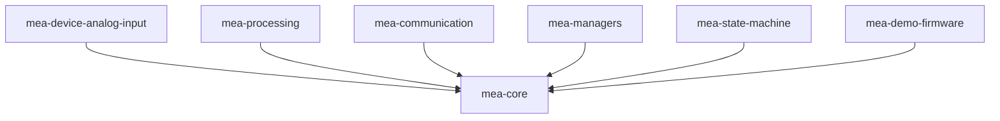
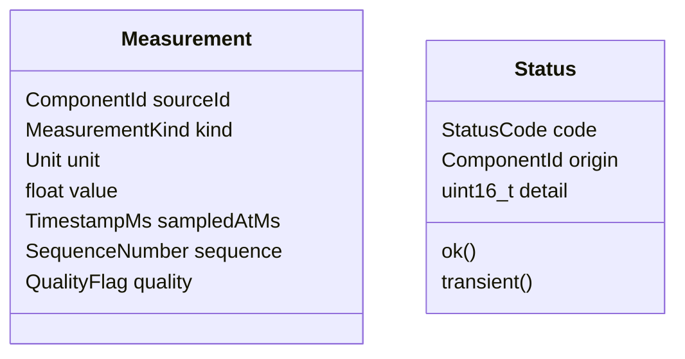
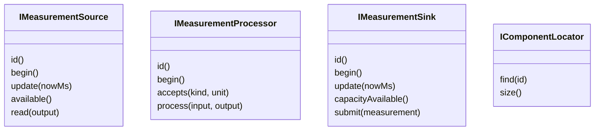

# MEA Core

`mea-core` ist die gemeinsame Sprache der MEA-Plattform. Diese Library enthaelt
keine Arduino-Abhaengigkeit und kann nativ auf dem Entwicklungs-PC getestet
werden.

## Wofuer diese Library gedacht ist

Nutze `mea-core`, wenn du:

- eine neue MEA-kompatible Library schreiben willst,
- gemeinsame Messwert-, Status- oder ID-Typen brauchst,
- Komponenten ueber stabile Interfaces koppeln willst,
- Tests ohne Hardware bauen willst.

Alle anderen MEA-Libraries haengen von `mea-core` ab.



## Zentrale Dateien

| Datei | Rolle |
|---|---|
| [src/MeaCore.h](src/MeaCore.h) | Sammel-Header fuer Nutzer der Library |
| [src/mea/core/Types.h](src/mea/core/Types.h) | `ComponentId`, `TimestampMs`, rollover-sichere Zeitfunktionen |
| [src/mea/core/Status.h](src/mea/core/Status.h) | Status- und Fehlermodell mit `origin` und `detail` |
| [src/mea/core/Measurement.h](src/mea/core/Measurement.h) | Messwertmodell mit `MeasurementKind`, `Unit`, `QualityFlag` |
| [src/mea/core/Interfaces.h](src/mea/core/Interfaces.h) | Source-, Processor-, Sink- und Locator-Interfaces |
| [src/mea/core/Command.h](src/mea/core/Command.h) | Basistypen fuer eingehende Kommandos |
| [src/mea/core/RingBuffer.h](src/mea/core/RingBuffer.h) | fester Ringpuffer ohne Heap |
| [src/mea/core/ArrayView.h](src/mea/core/ArrayView.h) | nicht besitzender Array-View fuer C++17 |
| [src/mea/core/Health.h](src/mea/core/Health.h) | Diagnosemodell fuer Manager |
| [src/mea/testing/ContractChecks.h](src/mea/testing/ContractChecks.h) | wiederverwendbare Interface-Contract-Checks fuer Tests |

## Datenmodell



`Status` und `Measurement::quality` sind bewusst getrennt:

- `Status` beschreibt, ob eine Operation funktioniert hat.
- `quality` beschreibt, ob der transportierte Wert fachlich eingeschraenkt ist.

Beispiel: Ein Clamp-Prozessor kann `Status::Ok` zurueckgeben und gleichzeitig
`QualityFlag::OutOfRange` setzen, weil die Verarbeitung technisch erfolgreich
war, der Wert aber begrenzt werden musste.

## Interfaces



Die Interfaces halten die Libraries lose gekoppelt. Ein Sensor kennt keinen
Manager, ein Prozessor kennt keine Hardware, und die State Machine findet
Komponenten nur ueber `IComponentLocator`.

## Minimalbeispiel

```cpp
#include <MeaCore.h>

mea::Measurement m{};
m.sourceId = 100;
m.kind = mea::MeasurementKind::Voltage;
m.unit = mea::Unit::Volt;
m.value = 1.65F;
m.sampledAtMs = 1234;
m.sequence = 1;

if (mea::isValid(m)) {
    // Wert kann weiterverarbeitet werden.
}
```

## Regeln fuer neue Libraries

- Oeffentliche Komponenten implementieren eines der MEA-Interfaces.
- IDs duerfen nie `mea::InvalidComponentId` sein.
- Fehlbare Funktionen liefern `mea::Status`.
- Keine dynamischen Fehlertexte; fuer Logging `statusCodeName()` nutzen.
- `update(nowMs)` muss kurz bleiben und darf nicht blockieren.

## Testen

```bash
pio test -e native
```

Die native Umgebung nutzt C++17, strikte Warnungen und Sanitizer.

## Design-Referenzen

- [../../docs/adr/0001-memory-and-ownership.md](../../docs/adr/0001-memory-and-ownership.md)
- [../../docs/adr/0002-status-and-error-model.md](../../docs/adr/0002-status-and-error-model.md)
- [../../docs/adr/0003-measurement-format.md](../../docs/adr/0003-measurement-format.md)
