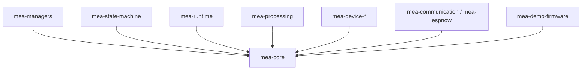
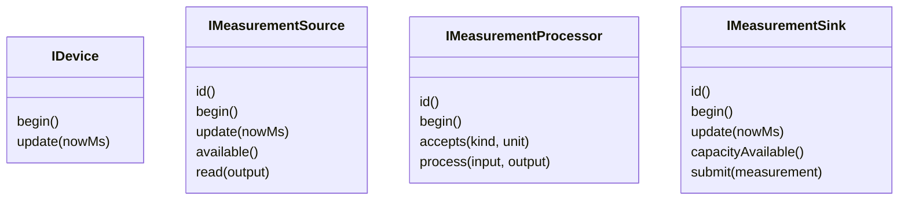

# MEA Core

`mea-core` ist die stabile gemeinsame Sprache der MEA-Plattform. Diese Library
bleibt hardwarefrei und darf von keinem anderen MEA-Repo abhaengen.

Dieses README beschreibt den Zielstand nach dem Umbauplan:
[../../docs/08-UMBAUPLAN-MODULARE-EINHEIT.md](../../docs/08-UMBAUPLAN-MODULARE-EINHEIT.md).

## Rolle im Gesamtsystem



`mea-core` definiert Vertraege, keine Implementierungsstrategie fuer ein
konkretes Board.

## Oeffentliche Bausteine

| Datei | Verantwortung |
|---|---|
| [src/MeaCore.h](src/MeaCore.h) | Sammel-Header |
| [src/mea/core/Types.h](src/mea/core/Types.h) | `ComponentId`, `TimestampMs`, Sequenzen, Zeithelfer |
| [src/mea/core/Status.h](src/mea/core/Status.h) | `StatusCode`, `Status`, Fehlerherkunft |
| [src/mea/core/Measurement.h](src/mea/core/Measurement.h) | Messwertformat, Art, Einheit, Quality-Flags |
| [src/mea/core/Interfaces.h](src/mea/core/Interfaces.h) | `IDevice`, Source, Processor, Sink, Locator |
| [src/mea/core/Command.h](src/mea/core/Command.h) | Basistypen fuer eingehende Kommandos |
| [src/mea/core/RingBuffer.h](src/mea/core/RingBuffer.h) | statischer Ringpuffer ohne Heap |
| [src/mea/core/ArrayView.h](src/mea/core/ArrayView.h) | nicht besitzende Sicht auf Konfigurationsarrays |
| [src/mea/core/Health.h](src/mea/core/Health.h) | Diagnosemodell fuer Manager und Runtime |
| [src/mea/testing/ContractChecks.h](src/mea/testing/ContractChecks.h) | wiederverwendbare Contract-Checks |

## Interface-Vertrag



Regeln:

- Quellen liefern Messwerte ueber `available()` und `read()`.
- Prozessoren veraendern die Eingabe nicht, sondern schreiben in `output`.
- Sinks uebernehmen Messwerte per `submit()`.
- Devices sind geteilte Dienste wie I2C-Chips, Transporte oder Funk-Clients.

## Status und Messwertqualitaet

`Status` und `Measurement::quality` bleiben getrennt:

- `Status` sagt, ob eine Operation erfolgreich war.
- `quality` sagt, ob ein transportierter Messwert fachlich markiert ist.

Beispiel: Ein Clamp-Prozessor kann `StatusCode::Ok` liefern und gleichzeitig
`QualityFlag::OutOfRange` setzen.

## Regeln fuer Erweiterungen

1. Neue Statuscodes nur anhaengen, nicht umnummerieren.
2. Neue `MeasurementKind`/`Unit`-Werte nur anhaengen.
3. Keine Arduino-, ESP32- oder Projekt-Header einbinden.
4. Keine globalen Singletons.
5. Keine dynamische Allokation als Besitzmodell.

## Testen

```bash
pio test -e native
```

Die native Umgebung ist der Vertragstest fuer alle nachgelagerten Repos.
