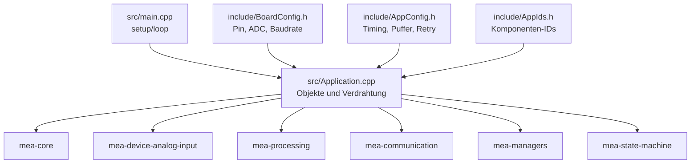
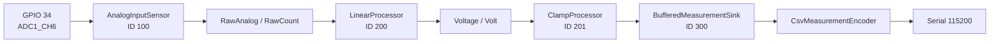
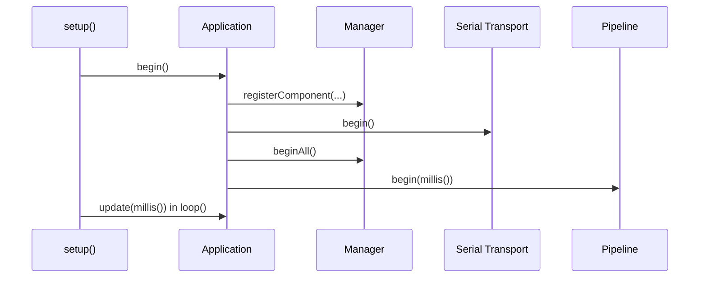

# MEA Demo Firmware

`mea-demo-firmware` ist die Referenzanwendung fuer den MEA-Workspace. Dieses
Repository zeigt, wie die einzelnen Libraries in einer echten PlatformIO-
Firmware zusammengesetzt werden.

Die Demo laeuft auf `esp32dev`, liest GPIO 34 als ADC, rechnet den Rohwert in
Volt um, begrenzt den Wert auf den erlaubten Bereich und gibt CSV ueber Serial
aus.

## Systemrolle

Dieses Repo ist der **Composition Root**. Nur hier werden konkrete Hardware,
Pins, IDs, Prozessorreihenfolge, Sinks und Pipeline-Parameter zusammengefuehrt.
Die Libraries bleiben dadurch wiederverwendbar und kennen weder Board noch
Anwendung.



## Datenfluss



CSV-Format:

```text
version;source_id;kind;unit;value;sampled_at_ms;sequence;quality
```

Beispiel:

```text
1;100;2;2;1.650;12345;42;0
```

## Zentrale Dateien

| Datei | Rolle |
|---|---|
| [platformio.ini](platformio.ini) | PlatformIO-Umgebungen, lokale Library-Abhaengigkeiten |
| [include/BoardConfig.h](include/BoardConfig.h) | Board-spezifische Werte: Pin, ADC-Maximalwert, Referenzspannung, Baudrate |
| [include/AppConfig.h](include/AppConfig.h) | Sampling, Verarbeitung, Queue-Groessen, Pipeline-Timeouts, Retry |
| [include/AppIds.h](include/AppIds.h) | stabile Komponenten-IDs |
| [src/Application.h](src/Application.h) | Application-Klasse und statisch lebende Komponenten |
| [src/Application.cpp](src/Application.cpp) | Registrierung, Initialisierung, PipelineConfig, Update-Reihenfolge |
| [src/main.cpp](src/main.cpp) | Arduino `setup()` und `loop()` |
| [docs/wiring.md](docs/wiring.md) | Verdrahtung des Demo-Aufbaus |
| [docs/runtime.md](docs/runtime.md) | Laufzeitverhalten und RAM-relevante Puffer |

## Konfiguration

### Board

[include/BoardConfig.h](include/BoardConfig.h):

```cpp
constexpr std::uint8_t kAnalogInputPin = 34;
constexpr std::uint32_t kAdcMaximumRaw = 4095;
constexpr float kAdcReferenceVolt = 3.3F;
constexpr std::uint32_t kSerialBaudRate = 115200;
```

Hier wird angepasst, wenn ein anderes Board, ein anderer ADC-Pin oder eine
andere serielle Geschwindigkeit verwendet wird.

### Anwendung

[include/AppConfig.h](include/AppConfig.h):

```cpp
constexpr mea::TimestampMs kSensorSampleIntervalMs = 250;
constexpr std::uint16_t kSamplesPerMeasurement = 8;
constexpr std::uint8_t kMaxSamplesPerUpdate = 2;
constexpr mea::TimestampMs kPipelineCycleIntervalMs = 1000;
constexpr mea::RetryPolicy kRetryPolicy{250, 3};
```

Hier liegen die Parameter, die das Laufzeitverhalten bestimmen: Messrate,
Oversampling, Puffer, Timeouts und Retry-Verhalten.

### IDs

[include/AppIds.h](include/AppIds.h):

| ID | Komponente |
|---:|---|
| `100` | `AnalogInput1` |
| `200` | `RawToVoltage` |
| `201` | `VoltageClamp` |
| `300` | `SerialOutput` |
| `400` | `MeasurementPipeline` |

ID `0` ist reserviert und darf nicht registriert werden.

## Initialisierung



Die Reihenfolge ist wichtig: Erst registrieren, dann Transport und Komponenten
initialisieren, dann die Pipeline starten. Die Pipeline loest in `begin()` nur
IDs auf; sie initialisiert keine Manager.

## Laufzeit

[src/main.cpp](src/main.cpp) ruft nur:

```cpp
application.update(millis());
```

In [src/Application.cpp](src/Application.cpp) passiert dann:

1. `sources_.updateAll(nowMs)` sammelt Sensorwerte.
2. `serialTransport_.update(nowMs)` treibt den Transport.
3. `sinks_.updateAll(nowMs)` schreibt gepufferte Frames weiter.
4. `pipeline_.update(nowMs)` liest, verarbeitet und veroeffentlicht Messwerte.

Keine Library verwendet `delay()` in der zyklischen Verarbeitung.

## Befehle

```bash
pio test -e native
pio run -e esp32dev
pio run -e esp32dev -t upload
pio device monitor -b 115200
```

Weitere Umgebungen:

| Umgebung | Zweck |
|---|---|
| `native` | Integrationstest auf dem PC mit Fakes |
| `native_debug` | Debug-Variante der nativen Tests |
| `esp32dev` | Firmware-Build fuer ESP32 DevKit |
| `esp32dev_test` | Embedded-Smoke-Test |
| `esp32dev_release` | Release-Build mit `NDEBUG` |

## Verdrahtung

Ein analoges Signal zwischen GND und der zulaessigen ADC-Eingangsspannung des
konkreten Boards an GPIO 34 anschliessen.

```text
Spannungsquelle 0 ... 3.3 V  -> GPIO 34
GND der Quelle               -> GND ESP32
```

Details und Poti-Beispiel: [docs/wiring.md](docs/wiring.md)

## Lokale Libraries

Die Firmware nutzt lokale Symlinks:

```ini
lib_deps =
    mea-core=symlink://../mea-core
    mea-processing=symlink://../mea-processing
    mea-managers=symlink://../mea-managers
    mea-state-machine=symlink://../mea-state-machine
    mea-device-analog-input=symlink://../mea-device-analog-input
    mea-communication=symlink://../mea-communication
```

Das ist fuer Entwicklung gewollt: Aenderungen in einer Library sind sofort im
Firmware-Build sichtbar. Fuer Releases sollten Git-Tags oder Commit-Hashes
gepinnt werden.

## Typische Aenderungen

### Anderer ADC-Pin

1. `kAnalogInputPin` in [include/BoardConfig.h](include/BoardConfig.h) aendern.
2. Verdrahtung anpassen.
3. `pio run -e esp32dev` ausfuehren.

### Andere Messrate

1. `kSensorSampleIntervalMs` in [include/AppConfig.h](include/AppConfig.h) anpassen.
2. Bei Bedarf `kPipelineCycleIntervalMs` anpassen.
3. Native Test und Firmware-Build ausfuehren.

### Weiterer Prozessor

1. Prozessor als Member in [src/Application.h](src/Application.h) aufnehmen.
2. ID in [include/AppIds.h](include/AppIds.h) vergeben.
3. In [src/Application.cpp](src/Application.cpp) registrieren.
4. ID in `kProcessorIds[]` einfuegen.

### Weiterer Sink

1. Sink als Member aufnehmen.
2. ID vergeben.
3. Sink registrieren.
4. ID in `kSinkIds[]` aufnehmen.
5. Kapazitaeten in [include/AppConfig.h](include/AppConfig.h) pruefen.

## Weiterfuehrende Doku

- [../../docs/00-VERWENDUNG-UND-KONFIGURATION.md](../../docs/00-VERWENDUNG-UND-KONFIGURATION.md)
- [../../docs/02-ARCHITEKTUR.md](../../docs/02-ARCHITEKTUR.md)
- [../../docs/07-CODE-TOUR-FUER-TEAMS.md](../../docs/07-CODE-TOUR-FUER-TEAMS.md)
