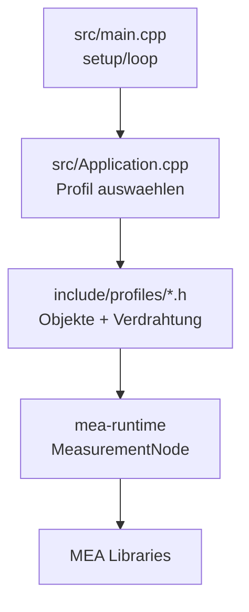
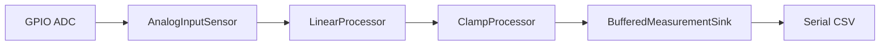
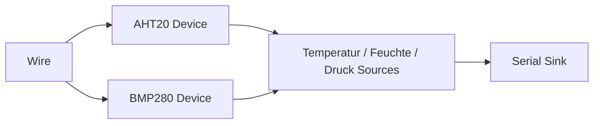
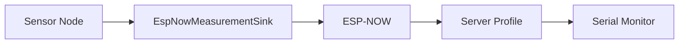

# MEA Demo Firmware

`mea-demo-firmware` ist der Composition Root der MEA-Plattform. Dieses Repo
zeigt im Zielstand, wie alle Libraries als eine logische Einheit auf einem
ESP32 zusammenspielen.

Zielstand nach Umbauplan:
[../../docs/08-UMBAUPLAN-MODULARE-EINHEIT.md](../../docs/08-UMBAUPLAN-MODULARE-EINHEIT.md).

## Rolle im Zielsystem

Nur dieses Repo kennt konkrete Hardware:

- Board und Pins,
- App-IDs,
- Sensorbestueckung,
- Pipeline-Profile,
- serielle Ausgabe oder ESP-NOW,
- PlatformIO-Umgebungen.

Alle wiederverwendbaren Bausteine bleiben in den Libraries.



## Zielstruktur

```text
include/
  AppIds.h
  BoardConfig.h
  profiles/
    AnalogSerialProfile.h
    I2cSerialProfile.h
    EspNowClientProfile.h
    EspNowServerProfile.h
src/
  Application.cpp
  Application.h
  main.cpp
test/
  native/
  embedded/
```

`Application` soll nur noch Profil und Runtime treiben. Manuelle Manager- und
`MeasurementPipelineMachine`-Verdrahtung sollen aus `Application.cpp`
verschwinden.

## Zielprofile

| PlatformIO-Environment | Datenfluss |
|---|---|
| `native` | Integrationstests mit Fakes |
| `esp32dev_analog_serial` | ADC -> Processing -> Serial CSV |
| `esp32dev_i2c_serial` | AHT20/BMP280 -> Serial CSV |
| `esp32dev_espnow_client` | Sensoren -> Processing -> Serial + ESP-NOW |
| `esp32dev_espnow_server` | ESP-NOW Empfang -> Serial |
| `esp32dev_test` | Embedded-Smoke |

## Zielverdrahtung mit `MeasurementNode`

```cpp
void Application::begin() {
    Serial.begin(board::kSerialBaudRate);
    profile_.configure(node_);
    const mea::Status status = node_.begin(millis());
    healthy_ = status.ok();
}

void Application::update(mea::TimestampMs nowMs) {
    if (healthy_) {
        (void)node_.update(nowMs);
    }
}
```

Ein Profil beschreibt dann die eigentliche Pipeline:

```cpp
node.setReporter(&Application::reportStatus);
node.setDefaultTuning({1000, 2000, 500, {250, 3}, true});

node.addDevice(serialTransport);
node.addPipeline(ids::SoilVoltagePipeline, analogSensor)
    .through(rawToVoltage, voltageClamp)
    .into(serialSink);
```

## Ziel-Datenfluesse

Analog + Serial:



I2C + Serial:



ESP-NOW:



## IDs

Empfohlene Bereiche:

| Bereich | Zweck |
|---|---|
| 100-199 | Sources |
| 200-299 | Processors |
| 300-399 | Sinks |
| 400-499 | Pipelines |
| 500-599 | Devices |
| 600-699 | Command Sources |
| 700-799 | Command Handlers |

IDs liegen nur in [include/AppIds.h](include/AppIds.h). Libraries definieren
keine App-IDs.

## Lokale Libraries

Ziel-`lib_deps`:

```ini
lib_deps =
    mea-core=symlink://../mea-core
    mea-managers=symlink://../mea-managers
    mea-state-machine=symlink://../mea-state-machine
    mea-runtime=symlink://../mea-runtime
    mea-processing=symlink://../mea-processing
    mea-device-analog-input=symlink://../mea-device-analog-input
    mea-device-aht20=symlink://../mea-device-aht20
    mea-device-bmp280=symlink://../mea-device-bmp280
    mea-communication=symlink://../mea-communication
    mea-espnow=symlink://../mea-espnow
```

Fuer Releases werden diese lokalen Symlinks durch Git-Tags oder Commit-Hashes
ersetzt.

## Befehle im Zielstand

```bash
pio test -e native
pio run -e esp32dev_analog_serial
pio run -e esp32dev_i2c_serial
pio run -e esp32dev_espnow_client
pio run -e esp32dev_espnow_server
pio test -e esp32dev_test --without-uploading --without-testing
```

Upload eines Profils:

```bash
pio run -e esp32dev_analog_serial -t upload
pio device monitor -b 115200
```

## Umbauaufgaben in diesem Repo

1. `mea-runtime` in `platformio.ini` einbinden.
2. `Application` auf `MeasurementNode` umstellen.
3. Profile unter `include/profiles/` anlegen.
4. AHT20/BMP280-Profile verdrahten.
5. ESP-NOW Client- und Server-Profile verdrahten.
6. Native Integrationstests pro Profil ergaenzen.
7. Embedded-Smoke-Builds pro Profil absichern.

## Weiterfuehrende Doku

- [../../docs/08-UMBAUPLAN-MODULARE-EINHEIT.md](../../docs/08-UMBAUPLAN-MODULARE-EINHEIT.md)
- [../../docs/02-ARCHITEKTUR.md](../../docs/02-ARCHITEKTUR.md)
- [../../docs/05-NEUE-LIBRARY-ANLEGEN.md](../../docs/05-NEUE-LIBRARY-ANLEGEN.md)
- [docs/wiring.md](docs/wiring.md)
- [docs/runtime.md](docs/runtime.md)
