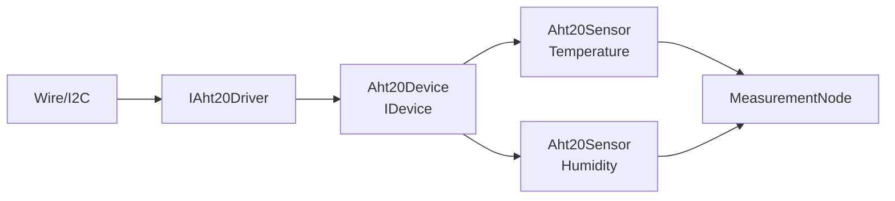

# MEA AHT20 Device

`mea-device-aht20` bindet einen AHT20 als MEA-kompatibles Shared-Device ein.
Ein Chip liefert zwei Messgroessen: Temperatur und Luftfeuchte.

Zielstand nach Umbauplan:
[../../docs/08-UMBAUPLAN-MODULARE-EINHEIT.md](../../docs/08-UMBAUPLAN-MODULARE-EINHEIT.md).

## Rolle im Zielsystem



## Zielnutzung mit Runtime

```cpp
mea::ArduinoAht20Driver aht20Driver(Wire);
mea::Aht20Device aht20Device(aht20Driver, {
    config::kI2cSampleIntervalMs,
    config::kAht20MeasurementTimeoutMs,
});
mea::Aht20Sensor aht20Temperature(aht20Device, {
    ids::Aht20Temperature,
    mea::Aht20Sensor::Channel::Temperature,
});
mea::Aht20Sensor aht20Humidity(aht20Device, {
    ids::Aht20Humidity,
    mea::Aht20Sensor::Channel::Humidity,
});

node.addDevice(aht20Device);
node.addPipeline(ids::Aht20TemperaturePipeline, aht20Temperature)
    .requires(aht20Device)
    .into(serialSink);
node.addPipeline(ids::Aht20HumidityPipeline, aht20Humidity)
    .requires(aht20Device)
    .into(serialSink);
```

`requires()` ist Teil des geplanten Runtime-Refactors. Bis dahin muss die Demo
die Device-Reihenfolge explizit sauber halten.

## Laufzeitverhalten

1. `Aht20Device` startet und liest den Chip nicht blockierend.
2. Ein fertiges Sample bekommt eine gemeinsame `sampleId`.
3. `Aht20Sensor`-Kanaele erkennen neue Samples ueber diese ID.
4. Jeder Kanal hat eigene Queue, eigene Source-ID und eigene Sequenznummer.
5. Temperatur wird als `Temperature/DegreeCelsius` geliefert.
6. Feuchte wird als `Humidity/Percent` geliefert.

## Zentrale Dateien

| Datei | Verantwortung |
|---|---|
| [src/MeaAht20.h](src/MeaAht20.h) | Sammel-Header |
| [src/mea/device/aht20/IAht20Driver.h](src/mea/device/aht20/IAht20Driver.h) | HAL-Interface |
| [src/mea/device/aht20/ArduinoAht20Driver.h](src/mea/device/aht20/ArduinoAht20Driver.h) | Arduino/Wire-Treiber |
| [src/mea/device/aht20/Aht20Device.h](src/mea/device/aht20/Aht20Device.h) | Shared-Device |
| [src/mea/device/aht20/Aht20Sensor.h](src/mea/device/aht20/Aht20Sensor.h) | Source je Kanal |
| [src/mea/device/aht20/testing/FakeAht20Driver.h](src/mea/device/aht20/testing/FakeAht20Driver.h) | Fake fuer Tests |

## Abhaengigkeiten

| Dependency | Warum |
|---|---|
| [../mea-core](../mea-core) | `IDevice`, `IMeasurementSource`, `Measurement`, `Status` |

## Testen

```bash
pio test -e native
```
