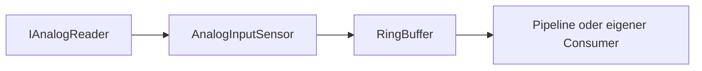
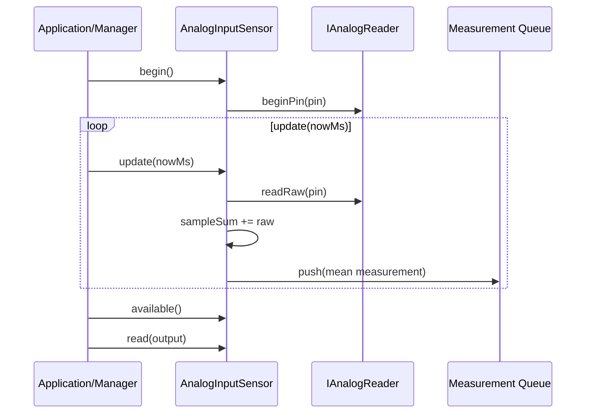

# MEA Analog Input Device

`mea-device-analog-input` ist eine Beispiel-Device-Library fuer eine
nicht blockierende analoge Messquelle. Sie liest rohe ADC-Werte ueber eine
kleine HAL (`IAnalogReader`) und liefert standardisierte `mea::Measurement`-
Pakete.

## Wofuer diese Library gedacht ist

Nutze diese Library, wenn du:

- einen Arduino-kompatiblen ADC als MEA-Source verwenden willst,
- ein Muster fuer neue Device-Libraries brauchst,
- Hardwarezugriff und Messwertlogik testbar trennen willst.



## Abhaengigkeiten

| Dependency | Warum |
|---|---|
| [../mea-core](../mea-core) | `IMeasurementSource`, `Measurement`, `Status`, `RingBuffer` |

`AnalogInputSensor` selbst ist hardwareabstrahiert. Nur
`ArduinoAnalogReader` nutzt Arduino-Funktionen.

## Zentrale Dateien

| Datei | Rolle |
|---|---|
| [src/MeaAnalogInput.h](src/MeaAnalogInput.h) | Sammel-Header |
| [src/mea/device/IAnalogReader.h](src/mea/device/IAnalogReader.h) | Hardware-Abstraktion fuer ADC-Zugriff |
| [src/mea/device/ArduinoAnalogReader.h](src/mea/device/ArduinoAnalogReader.h) | Arduino-Implementierung ueber `analogRead` |
| [src/mea/device/AnalogInputSensor.h](src/mea/device/AnalogInputSensor.h) | MEA-Source mit Oversampling und Queue |
| [src/mea/device/testing/FakeAnalogReader.h](src/mea/device/testing/FakeAnalogReader.h) | Fake fuer native Tests |
| [examples/esp32-smoke](examples/esp32-smoke) | kleines ESP32-Beispiel |

## Laufzeitverhalten



Der Sensor blockiert nicht: Pro `update()` werden hoechstens
`maxSamplesPerUpdate` ADC-Samples genommen. Fuer einen fertigen Messwert wird
ueber `samplesPerMeasurement` Rohwerte gemittelt.

## Konfiguration

```cpp
mea::AnalogInputSensor::Config cfg{};
cfg.sourceId = 100;
cfg.pin = 34;
cfg.sampleIntervalMs = 250;
cfg.samplesPerMeasurement = 8;
cfg.maxSamplesPerUpdate = 2;
cfg.outputKind = mea::MeasurementKind::RawAnalog;
cfg.outputUnit = mea::Unit::RawCount;
```

Die Library rechnet nicht in Volt um. Das ist Absicht: Hardware-Erfassung und
fachliche Verarbeitung bleiben getrennt. Die Umrechnung passiert zum Beispiel
mit `mea::LinearProcessor` aus [../mea-processing](../mea-processing).

## Drop-Policy

Wenn der interne Messwertpuffer voll ist, wird der neue fertige Messwert
verworfen und `droppedMeasurements()` erhoeht. Die Sequenznummer laeuft trotzdem
weiter, sodass Verbraucher verlorene Werte an Sequenzluecken erkennen koennen.

## Standalone-Nutzung

```ini
lib_deps =
    mea-core=symlink://../mea-core
    mea-device-analog-input=symlink://../mea-device-analog-input
```

```cpp
#include <MeaAnalogInput.h>

mea::ArduinoAnalogReader reader(4095);
mea::AnalogInputSensor sensor(reader, cfg);
```

## Testen

```bash
pio test -e native
```

Native Tests nutzen `FakeAnalogReader`, damit keine Arduino-Hardware benoetigt
wird.

## Design-Referenzen

- [../../docs/adr/0001-memory-and-ownership.md](../../docs/adr/0001-memory-and-ownership.md)
- [../../docs/adr/0004-component-lifecycle.md](../../docs/adr/0004-component-lifecycle.md)
