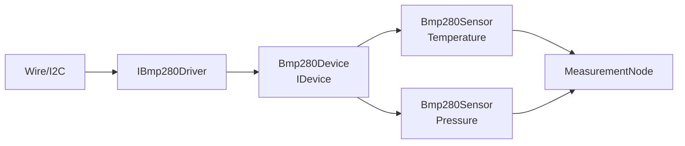

# MEA BMP280 Device

`mea-device-bmp280` bindet einen BMP280 als MEA-kompatibles Shared-Device ein.
Ein Chip liefert zwei Messgroessen: Temperatur und Luftdruck.

Zielstand nach Umbauplan:
[../../docs/08-UMBAUPLAN-MODULARE-EINHEIT.md](../../docs/08-UMBAUPLAN-MODULARE-EINHEIT.md).

## Rolle im Zielsystem



## Zielnutzung mit Runtime

```cpp
mea::ArduinoBmp280Driver bmp280Driver(Wire, 0x77);
mea::Bmp280Device bmp280Device(bmp280Driver, {
    config::kI2cSampleIntervalMs,
});
mea::Bmp280Sensor bmp280Temperature(bmp280Device, {
    ids::Bmp280Temperature,
    mea::Bmp280Sensor::Channel::Temperature,
});
mea::Bmp280Sensor bmp280Pressure(bmp280Device, {
    ids::Bmp280Pressure,
    mea::Bmp280Sensor::Channel::Pressure,
});

node.addDevice(bmp280Device);
node.addPipeline(ids::Bmp280TemperaturePipeline, bmp280Temperature)
    .requires(bmp280Device)
    .into(serialSink);
node.addPipeline(ids::Bmp280PressurePipeline, bmp280Pressure)
    .requires(bmp280Device)
    .through(paToHpa)
    .into(serialSink);
```

`requires()` ist Teil des geplanten Runtime-Refactors. Bis dahin muss die Demo
die Device-Reihenfolge explizit sauber halten.

## Laufzeitverhalten

1. `Bmp280Device` initialisiert den Chip und liest Samples im Intervall.
2. Ein fertiges Sample bekommt eine gemeinsame `sampleId`.
3. `Bmp280Sensor`-Kanaele erkennen neue Samples ueber diese ID.
4. Jeder Kanal hat eigene Queue, eigene Source-ID und eigene Sequenznummer.
5. Temperatur wird als `Temperature/DegreeCelsius` geliefert.
6. Druck wird als `Pressure/Pascal` geliefert.

## Zentrale Dateien

| Datei | Verantwortung |
|---|---|
| [src/MeaBmp280.h](src/MeaBmp280.h) | Sammel-Header |
| [src/mea/device/bmp280/IBmp280Driver.h](src/mea/device/bmp280/IBmp280Driver.h) | HAL-Interface |
| [src/mea/device/bmp280/ArduinoBmp280Driver.h](src/mea/device/bmp280/ArduinoBmp280Driver.h) | Arduino/Wire-Treiber |
| [src/mea/device/bmp280/Bmp280Device.h](src/mea/device/bmp280/Bmp280Device.h) | Shared-Device |
| [src/mea/device/bmp280/Bmp280Sensor.h](src/mea/device/bmp280/Bmp280Sensor.h) | Source je Kanal |
| [src/mea/device/bmp280/testing/FakeBmp280Driver.h](src/mea/device/bmp280/testing/FakeBmp280Driver.h) | Fake fuer Tests |

## Abhaengigkeiten

| Dependency | Warum |
|---|---|
| [../mea-core](../mea-core) | `IDevice`, `IMeasurementSource`, `Measurement`, `Status` |

## Testen

```bash
pio test -e native
```
