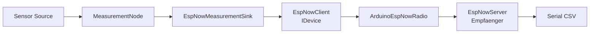
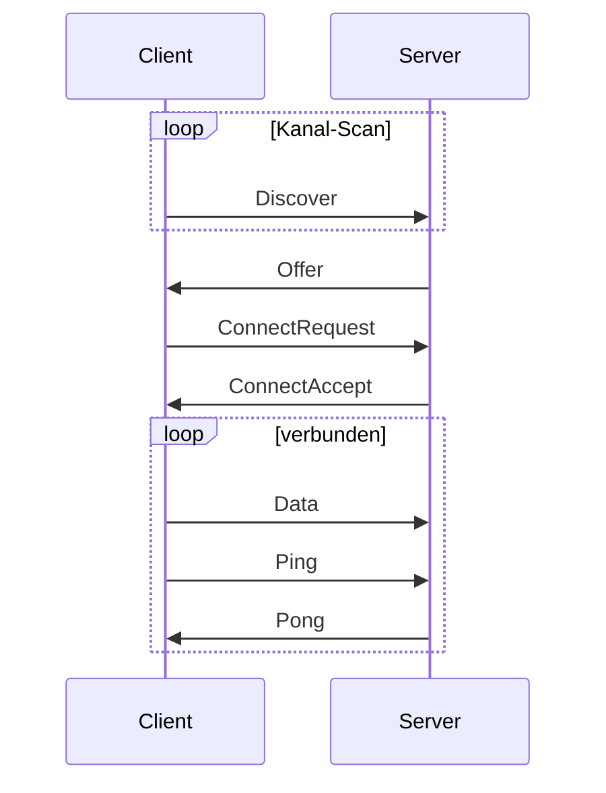

# MEA ESP-NOW

`mea-espnow` ist die drahtlose Kommunikationsschicht der MEA-Plattform. Sie
stellt ESP-NOW als normalen MEA-Baustein bereit: Client und Server sind
`IDevice`s, der Sendepfad ist ein `IMeasurementSink`.

Zielstand nach Umbauplan:
[../../docs/08-UMBAUPLAN-MODULARE-EINHEIT.md](../../docs/08-UMBAUPLAN-MODULARE-EINHEIT.md).

## Rolle im Zielsystem



## Protokollziel



Der Sensor-Node braucht keine feste Server-MAC und keinen festen Kanal. Der
Server antwortet auf Discovery, der Client verbindet sich und reconnectet bei
Heartbeat-Ausfall.

## Zielnutzung: Sensor-Node

```cpp
mea::ArduinoEspNowRadio radio;
mea::EspNowClient espNowClient(radio, {150, 500, 1000, 3, 1});
mea::CsvMeasurementEncoder csv({';', 3});
mea::EspNowMeasurementSink<8> espNowSink(
    espNowClient,
    csv,
    ids::EspNowOutput);

node.addDevice(espNowClient);
node.addPipeline(ids::SoilVoltagePipeline, analogSensor)
    .through(rawToVoltage, voltageClamp)
    .into(serialSink, espNowSink);
```

## Zielnutzung: Server-Node

```cpp
mea::ArduinoEspNowRadio radio;
mea::EspNowServer server(radio, {1, 5000});

server.begin();

void loop() {
    server.update(millis());
    mea::EspNowDataFrame frame{};
    while (server.available() > 0 && server.read(frame).ok()) {
        Serial.write(frame.payload, frame.payloadSize);
    }
}
```

Im Demo-Zielstand wird daraus ein eigenes PlatformIO-Profil
`esp32dev_espnow_server`.

## Drop-Policy

ESP-NOW ist verlustbehaftet. Deshalb nutzt `EspNowMeasurementSink` bewusst
Drop-Oldest: Wenn die Queue voll ist, wird der aelteste Wert entfernt und der
neue Wert uebernommen. Frische Messwerte sind fuer Funk wichtiger als
Backpressure auf die Messpipeline.

## Zentrale Dateien

| Datei | Verantwortung |
|---|---|
| [src/MeaEspNow.h](src/MeaEspNow.h) | Sammel-Header |
| [src/mea/espnow/EspNowTypes.h](src/mea/espnow/EspNowTypes.h) | Frame- und Protokolltypen |
| [src/mea/espnow/IEspNowRadio.h](src/mea/espnow/IEspNowRadio.h) | Funk-HAL |
| [src/mea/espnow/ArduinoEspNowRadio.h](src/mea/espnow/ArduinoEspNowRadio.h) | ESP32-Implementierung |
| [src/mea/espnow/EspNowClient.h](src/mea/espnow/EspNowClient.h) | Sensorseite |
| [src/mea/espnow/EspNowServer.h](src/mea/espnow/EspNowServer.h) | Empfaengerseite |
| [src/mea/espnow/EspNowMeasurementSink.h](src/mea/espnow/EspNowMeasurementSink.h) | Pipeline-Sink |
| [src/mea/espnow/testing/FakeEspNowRadio.h](src/mea/espnow/testing/FakeEspNowRadio.h) | Fake fuer native Tests |

## Abhaengigkeiten

| Dependency | Warum |
|---|---|
| [../mea-core](../mea-core) | `IDevice`, `IMeasurementSink`, `Status`, `RingBuffer` |
| [../mea-communication](../mea-communication) | `IMeasurementEncoder` |

## Grenzen v1

- Unverschluesselt.
- Data-Frames laufen Client -> Server.
- Ein Frame muss in die ESP-NOW-Nutzlast passen.
- Es darf nur eine `ArduinoEspNowRadio`-Instanz geben.

## Testen

```bash
pio test -e native
```
