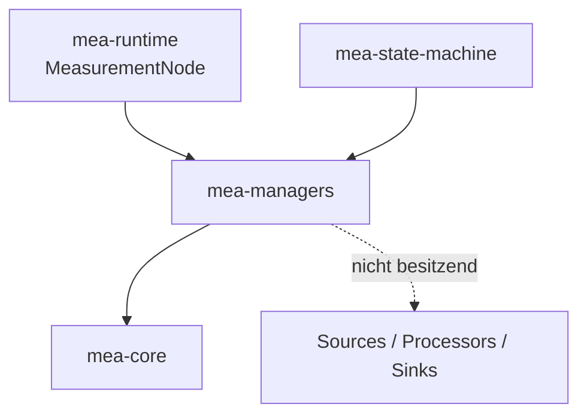
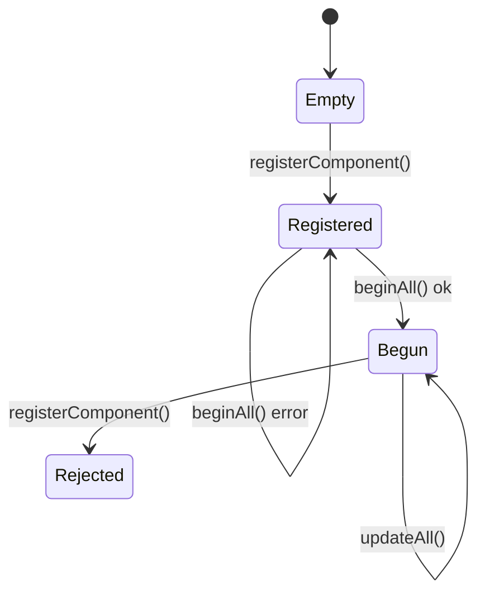

# MEA Managers

`mea-managers` stellt feste, nicht besitzende Registries fuer MEA-Komponenten
bereit. Manager sind Infrastruktur: Sie speichern Referenzen, initialisieren
Komponenten, treiben `update()` und liefern Health-Daten.

Zielstand nach Umbauplan:
[../../docs/08-UMBAUPLAN-MODULARE-EINHEIT.md](../../docs/08-UMBAUPLAN-MODULARE-EINHEIT.md).

## Rolle im Zielsystem



Im Zielzustand nutzt die Firmware Manager nicht mehr direkt. Der bevorzugte
Einstieg ist `MeasurementNode` aus `mea-runtime`. Die Manager bleiben darunter
die Registry- und Locator-Schicht.

## Manager-Typen

| Typ | Interface | Aufgabe |
|---|---|---|
| `SensorManager<N>` | `IMeasurementSource` | Quellen registrieren, beginnen und aktualisieren |
| `ProcessorManager<N>` | `IMeasurementProcessor` | Prozessoren registrieren und beginnen |
| `SinkManager<N>` | `IMeasurementSink` | Sinks registrieren, beginnen und aktualisieren |
| `CommandSourceManager<N>` | `ICommandSource` | Command-Quellen fuer Runtime-Erweiterung |
| `CommandHandlerManager<N>` | `ICommandHandler` | Command-Handler fuer Runtime-Erweiterung |

## Zentrale Dateien

| Datei | Verantwortung |
|---|---|
| [src/MeaManagers.h](src/MeaManagers.h) | Sammel-Header |
| [src/mea/managers/FixedRegistry.h](src/mea/managers/FixedRegistry.h) | ID-basierte Registry mit fester Kapazitaet |
| [src/mea/managers/ComponentManager.h](src/mea/managers/ComponentManager.h) | `registerComponent()`, `beginAll()`, Health |
| [src/mea/managers/Managers.h](src/mea/managers/Managers.h) | fachliche Manager-Klassen |

## Lebenszyklus



Nach erfolgreichem `beginAll()` ist Registrierung geschlossen. Das verhindert,
dass eine Pipeline zur Laufzeit gegen eine veraenderte Registry laeuft.

## Zielnutzung

Direktnutzung bleibt moeglich:

```cpp
mea::SensorManager<4> sources;
sources.registerComponent(sensor);
sources.beginAll();
sources.updateAll(nowMs);
```

Im Firmware-Zielstand wird das aber durch `MeasurementNode` gekapselt:

```cpp
node.addPipeline(ids::TemperaturePipeline, temperature)
    .into(serialSink);
node.begin(millis());
node.update(millis());
```

## Abhaengigkeiten

| Dependency | Warum |
|---|---|
| [../mea-core](../mea-core) | Interfaces, IDs, `Status`, `ComponentHealth` |

## Testen

```bash
pio test -e native
```
