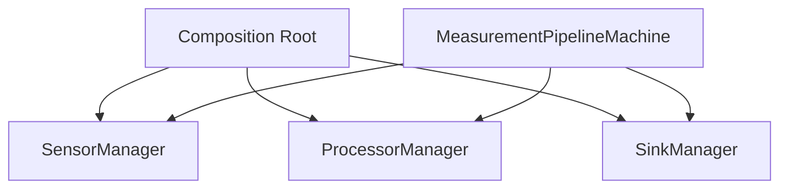
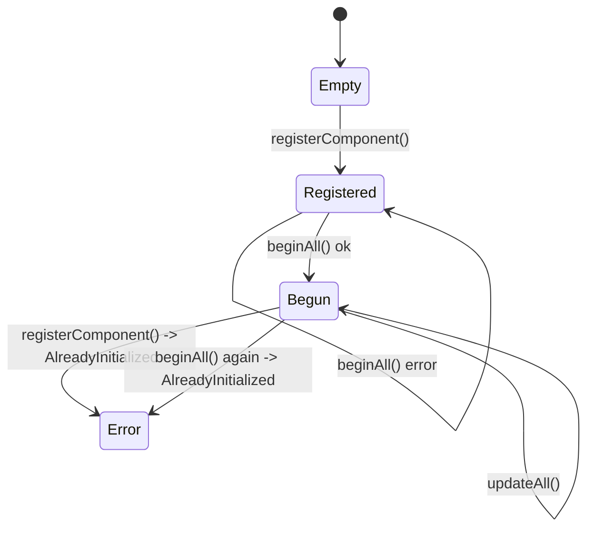
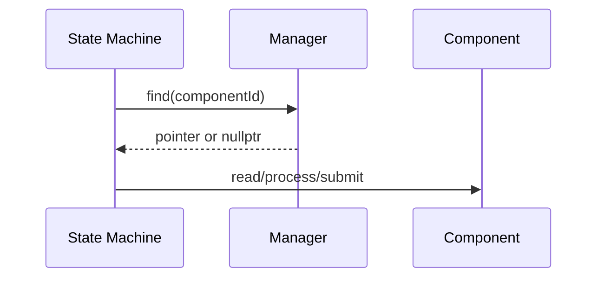

# MEA Managers

`mea-managers` stellt feste, nicht besitzende Registries fuer MEA-Komponenten
bereit. Manager sind bewusst dumm: Sie kennen keine Fachlogik, sondern
registrieren Komponenten, initialisieren sie einmalig, aktualisieren sie
optional und pflegen Diagnoseinformationen.

## Wofuer diese Library gedacht ist

Nutze `mea-managers`, wenn du:

- Komponenten ueber IDs auffindbar machen willst,
- feste Kapazitaeten ohne Heap brauchst,
- `begin()`/`update()` mehrerer Komponenten einheitlich treiben willst,
- Health-/Diagnoseinformationen pro Komponente sammeln willst.



## Abhaengigkeiten

| Dependency | Warum |
|---|---|
| [../mea-core](../mea-core) | Interfaces, IDs, Status, ComponentHealth |

## Zentrale Dateien

| Datei | Rolle |
|---|---|
| [src/MeaManagers.h](src/MeaManagers.h) | Sammel-Header |
| [src/mea/managers/FixedRegistry.h](src/mea/managers/FixedRegistry.h) | generische Registry mit fester Kapazitaet |
| [src/mea/managers/ComponentManager.h](src/mea/managers/ComponentManager.h) | Registrierung, `beginAll()`, Health |
| [src/mea/managers/Managers.h](src/mea/managers/Managers.h) | fachliche Typaliases/Klassen fuer Sources, Processors, Sinks, Commands |

## Manager-Typen

| Manager | Interface | `updateAll()` |
|---|---|---:|
| `SensorManager<N>` | `IMeasurementSource` | ja |
| `ProcessorManager<N>` | `IMeasurementProcessor` | nein |
| `SinkManager<N>` | `IMeasurementSink` | ja |
| `CommandSourceManager<N>` | `ICommandSource` | ja |
| `CommandHandlerManager<N>` | `ICommandHandler` | nein |

Prozessoren haben kein `update()`, weil sie zustandsarm ueber `process()`
arbeiten. Sinks und Sources haben `update()`, weil sie Puffer, Hardware oder
Transport fortschreiben.

## Lebenszyklus



`beginAll()` ist nach erfolgreichem Start genau einmal erlaubt. Das schuetzt vor
versehentlichen Reinitialisierungen durch andere Systemteile.

## Beispiel

```cpp
#include <MeaManagers.h>

mea::SensorManager<4> sources;
mea::ProcessorManager<4> processors;
mea::SinkManager<4> sinks;

sources.registerComponent(sensor);
processors.registerComponent(rawToVoltage);
sinks.registerComponent(serialSink);

sources.beginAll();
processors.beginAll();
sinks.beginAll();

sources.updateAll(nowMs);
sinks.updateAll(nowMs);
```

## Locator-Rolle

Manager implementieren `IComponentLocator<Interface>`. Die State Machine nutzt
das, um IDs aus `PipelineConfig` zu echten Komponenten aufzuloesen.



Die State Machine besitzt die Komponenten nicht. Sie cached nur Pointer, deren
Lebensdauer vom Composition Root garantiert wird.

## Health

`ComponentManager::health(id)` liefert:

- Komponenten-ID,
- letzten Status,
- Zaehler fuer Fehler und transiente Zustaende,
- Zeitstempel des letzten Updates.

Das ist bewusst Manager-Aufgabe. Komponenten bleiben kleiner und muessen kein
Diagnosemodell mit sich tragen.

## Standalone-Nutzung

```ini
lib_deps =
    mea-core=symlink://../mea-core
    mea-managers=symlink://../mea-managers
```

```cpp
#include <MeaManagers.h>
```

## Testen

```bash
pio test -e native
```

## Design-Referenzen

- [../../docs/adr/0001-memory-and-ownership.md](../../docs/adr/0001-memory-and-ownership.md)
- [../../docs/adr/0004-component-lifecycle.md](../../docs/adr/0004-component-lifecycle.md)
