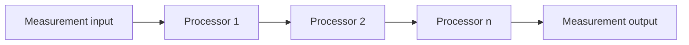

# MEA Processing

`mea-processing` enthaelt hardwareunabhaengige Messwertverarbeitung. Die
Library arbeitet ausschliesslich mit `mea::Measurement` und implementiert
`mea::IMeasurementProcessor` aus `mea-core`.

## Wofuer diese Library gedacht ist

Nutze `mea-processing`, wenn Messwerte:

- skaliert oder in eine andere Einheit ueberfuehrt werden sollen,
- geglaettet werden sollen,
- validiert oder begrenzt werden sollen,
- in Tests ohne Hardware durch eine echte Prozessorkette laufen sollen.



## Abhaengigkeiten

| Dependency | Warum |
|---|---|
| [../mea-core](../mea-core) | `Measurement`, `Status`, `IMeasurementProcessor`, Quality-Flags |

Die Library hat keine Arduino-Abhaengigkeit.

## Zentrale Dateien

| Datei | Rolle |
|---|---|
| [src/MeaProcessing.h](src/MeaProcessing.h) | Sammel-Header |
| [src/mea/processing/LinearProcessor.h](src/mea/processing/LinearProcessor.h) | lineare Umrechnung `value' = value * gain + offset` |
| [src/mea/processing/ClampProcessor.h](src/mea/processing/ClampProcessor.h) | Wert begrenzen und `OutOfRange` setzen |
| [src/mea/processing/RangeValidationProcessor.h](src/mea/processing/RangeValidationProcessor.h) | Wertebereich pruefen, Wert unveraendert lassen |
| [src/mea/processing/MovingAverageProcessor.h](src/mea/processing/MovingAverageProcessor.h) | gleitender Mittelwert mit fester Fensterlaenge |
| [src/mea/processing/PassThroughProcessor.h](src/mea/processing/PassThroughProcessor.h) | neutrales Kettenglied fuer Tests oder Platzhalter |

## Prozessoren

| Prozessor | Veraendert Wert | Veraendert Kind/Einheit | Quality-Flags |
|---|---:|---:|---|
| `LinearProcessor` | ja | ja, explizit konfiguriert | uebernimmt bestehende Flags |
| `ClampProcessor` | ja, wenn ausserhalb Bereich | nein | setzt `OutOfRange` |
| `RangeValidationProcessor` | nein | nein | setzt `OutOfRange` |
| `MovingAverageProcessor<N>` | ja | nein | setzt `Estimated`, bis Fenster voll ist |
| `PassThroughProcessor` | nein | nein | uebernimmt bestehende Flags |

## Beispiel: ADC-Rohwert zu Volt

```cpp
#include <MeaProcessing.h>

mea::LinearProcessor rawToVoltage({
    200,
    3.3F / 4095.0F,
    0.0F,
    mea::MeasurementKind::RawAnalog,
    mea::Unit::RawCount,
    mea::MeasurementKind::Voltage,
    mea::Unit::Volt,
});

mea::ClampProcessor voltageClamp({
    201,
    0.0F,
    3.3F,
    mea::MeasurementKind::Voltage,
    mea::Unit::Volt,
});
```

Aufruffolge:

```cpp
rawToVoltage.begin();
voltageClamp.begin();

mea::Measurement raw{};
mea::Measurement voltage{};
mea::Measurement safeVoltage{};

rawToVoltage.process(raw, voltage);
voltageClamp.process(voltage, safeVoltage);
```

## Warum `accepts(kind, unit)` existiert

Prozessoren sollen keine stillen Einheitenkonvertierungen machen. Ein
`LinearProcessor`, der `RawAnalog/RawCount` erwartet, soll nicht versehentlich
einen Temperaturwert verarbeiten. `MeasurementKind::Unknown` und `Unit::None`
wirken als Wildcard, wenn ein Prozessor bewusst generisch sein soll.

## Standalone-Nutzung

In einem anderen PlatformIO-Projekt:

```ini
lib_deps =
    mea-core=symlink://../mea-core
    mea-processing=symlink://../mea-processing
```

Dann:

```cpp
#include <MeaProcessing.h>
```

## Testen

```bash
pio test -e native
```

## Design-Referenzen

- [../../docs/adr/0003-measurement-format.md](../../docs/adr/0003-measurement-format.md)
- [../../docs/adr/0004-component-lifecycle.md](../../docs/adr/0004-component-lifecycle.md)
