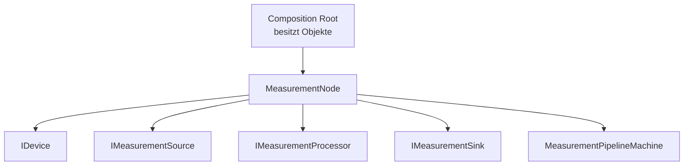
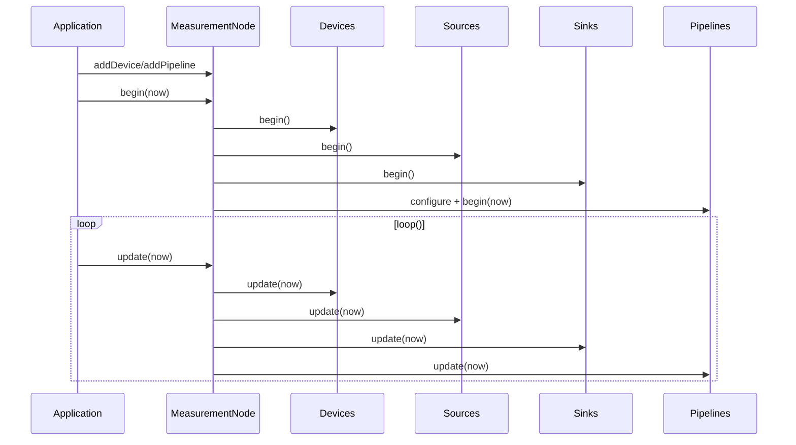

# MEA Runtime

`mea-runtime` ist die Integrations-Fassade der MEA-Plattform. Der zentrale Typ
ist `mea::MeasurementNode`: Er verdrahtet Devices, Sources, Processors, Sinks
und Pipelines ohne Manager-Boilerplate in der Firmware.

Zielstand nach Umbauplan:
[../../docs/08-UMBAUPLAN-MODULARE-EINHEIT.md](../../docs/08-UMBAUPLAN-MODULARE-EINHEIT.md).

## Rolle im Zielsystem



Die Runtime besitzt keine Komponenten. Sie haelt nur nicht besitzende Zeiger auf
Objekte, die im Composition Root leben.

## Ziel-API

```cpp
mea::MeasurementNode<8, 8, 4, 8, 6> node;

node.setReporter(&reportStatus);
node.setDefaultTuning({1000, 2000, 500, {250, 3}, true});

node.addDevice(serialTransport);
node.addDevice(aht20Device);

node.addPipeline(ids::Aht20TemperaturePipeline, aht20Temperature)
    .requires(aht20Device)
    .into(serialSink);

node.addPipeline(ids::SoilVoltagePipeline, analogSensor)
    .through(rawToVoltage, voltageClamp)
    .into(serialSink, espNowSink);

node.begin(millis());
node.update(millis());
```

`requires()` ist Ziel des naechsten Refactors: Pipelines sollen ausdruecklich
wissen, welche Devices fuer sie kritisch sind.

## Lebenszyklus



## Fehlerstrategie

| Fehler | Zielverhalten |
|---|---|
| doppelte IDs, Kapazitaet, fehlender Sink | `begin()` bricht ab |
| optionales Device faellt aus | Fehler melden, restliche Pipelines laufen |
| required Device faellt aus | nur betroffene Pipeline deaktivieren |
| Source faellt aus | abhaengige Pipeline deaktivieren |
| transienter Sink-Stau | Pipeline retryt ueber State Machine |

## Zentrale Dateien

| Datei | Verantwortung |
|---|---|
| [src/MeaRuntime.h](src/MeaRuntime.h) | Sammel-Header |
| [src/mea/runtime/MeasurementNode.h](src/mea/runtime/MeasurementNode.h) | Runtime-Fassade |

## Abhaengigkeiten

| Dependency | Warum |
|---|---|
| [../mea-core](../mea-core) | Interfaces, `Status`, Zeittypen |
| [../mea-managers](../mea-managers) | Registries/Locators |
| [../mea-state-machine](../mea-state-machine) | Pipeline-Ausfuehrung |

## Naechste Refactors

1. Demo-Firmware vollstaendig auf `MeasurementNode` umstellen.
2. `PipelineBuilder::requires(IDevice&)` einfuehren.
3. Diagnosezugriffe fuer Devices, Sources, Sinks und Pipelines ergaenzen.
4. Command-Quellen und Command-Handler in die Runtime aufnehmen.

## Testen

```bash
pio test -e native
```
