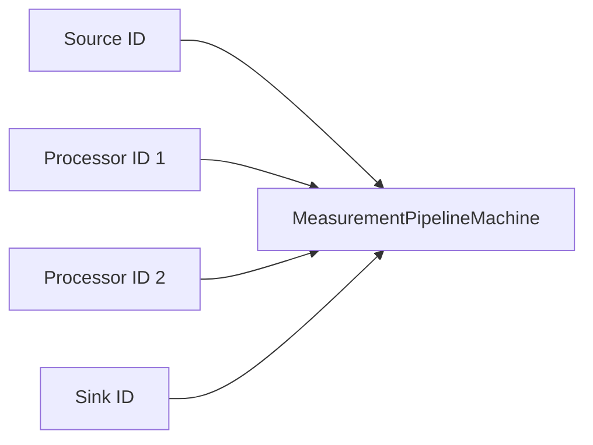
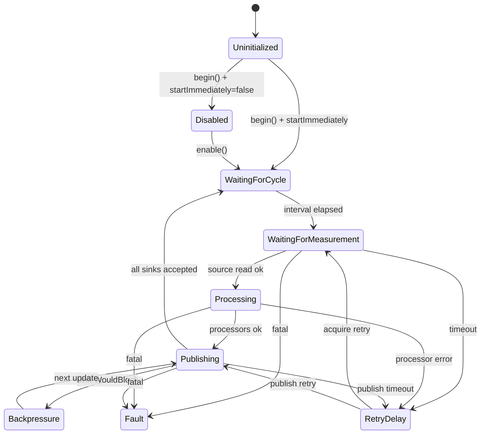

# MEA State Machine

`mea-state-machine` enthaelt die nicht blockierende
`MeasurementPipelineMachine`. Sie verbindet eine registrierte Messquelle, eine
geordnete Prozessorkette und eine oder mehrere Ausgaben ueber Komponenten-IDs.

Die State Machine kennt keine konkreten Sensor-, Prozessor- oder Sink-Klassen.
Sie spricht nur mit Interfaces aus `mea-core` und Locators aus den Managern.

## Wofuer diese Library gedacht ist

Nutze diese Library, wenn du:

- einen zyklischen Messwertfluss koordinieren willst,
- Backpressure und Timeouts sauber behandeln willst,
- Quellen, Prozessoren und Sinks austauschbar halten willst,
- keine blockierenden `delay()`-Ablaufe in der Firmware willst.



## Abhaengigkeiten

| Dependency | Warum |
|---|---|
| [../mea-core](../mea-core) | Interfaces, `PipelineConfig`-Bausteine, `Status`, `Measurement` |
| [../mea-managers](../mea-managers) | Locator-Implementierungen fuer registrierte Komponenten |

## Zentrale Dateien

| Datei | Rolle |
|---|---|
| [src/MeaStateMachine.h](src/MeaStateMachine.h) | Sammel-Header |
| [src/mea/state/PipelineTypes.h](src/mea/state/PipelineTypes.h) | `PipelineConfig`, `RetryPolicy`, `PipelineState` |
| [src/mea/state/MeasurementPipelineMachine.h](src/mea/state/MeasurementPipelineMachine.h) | oeffentliche State-Machine-API |
| [src/mea/state/MeasurementPipelineMachine.cpp](src/mea/state/MeasurementPipelineMachine.cpp) | Zustandslogik |

## Zustandsmodell



`Fault` ist sticky und wird nur durch ein explizites neues `begin(nowMs)`
verlassen. Normale Zyklusfehler fuehren ueber `RetryPolicy` zu Wiederholungen
und stoppen die Pipeline nicht dauerhaft.

## PipelineConfig

```cpp
constexpr mea::ComponentId processorIds[] = {200, 201};
constexpr mea::ComponentId sinkIds[] = {300};

mea::PipelineConfig cfg{};
cfg.pipelineId = 400;
cfg.sourceId = 100;
cfg.processorIds = mea::ArrayView<const mea::ComponentId>(processorIds, 2);
cfg.sinkIds = mea::ArrayView<const mea::ComponentId>(sinkIds, 1);
cfg.cycleIntervalMs = 1000;
cfg.acquisitionTimeoutMs = 2000;
cfg.publishTimeoutMs = 500;
cfg.retry = mea::RetryPolicy{250, 3};
cfg.startImmediately = true;
```

Die ID-Arrays muessen laenger leben als die State Machine. In der Demo liegen
sie deshalb statisch in [../mea-demo-firmware/src/Application.cpp](../mea-demo-firmware/src/Application.cpp).

## Update-Arbeit

Pro `update(nowMs)` passiert hoechstens ein Zustandsuebergang plus begrenzte
Arbeit des aktuellen Zustands:

- `WaitingForMeasurement`: prueft `available()` und liest maximal einen Wert.
- `Processing`: fuehrt die konfigurationsbegrenzte Prozessorkette aus.
- `Publishing`: versucht jeden noch ausstehenden Sink genau einmal.
- `Backpressure`: wartet nicht aktiv, sondern versucht im naechsten Update neu.

## Beispiel

```cpp
#include <MeaStateMachine.h>

mea::MeasurementPipelineMachine pipeline(sources, processors, sinks, cfg);

pipeline.begin(millis());

void loop() {
    const mea::TimestampMs now = millis();
    sources.updateAll(now);
    sinks.updateAll(now);
    pipeline.update(now);
}
```

Die State Machine ruft `sources.updateAll()` und `sinks.updateAll()` bewusst
nicht selbst auf. Der Composition Root bestimmt die Reihenfolge.

## Beobachtbarkeit

| Methode | Bedeutung |
|---|---|
| `state()` | aktueller Pipeline-Zustand |
| `lastStatus()` | letzter relevanter Status |
| `completedCycles()` | erfolgreich veroeffentlichte Zyklen |
| `failedCycles()` | abgeschriebene Zyklen |
| `droppedMeasurements()` | Werte, die beim Publizieren verloren gingen |
| `lastMeasurement()` | letzter fertig verarbeiteter Wert |

## Standalone-Nutzung

```ini
lib_deps =
    mea-core=symlink://../mea-core
    mea-managers=symlink://../mea-managers
    mea-state-machine=symlink://../mea-state-machine
```

```cpp
#include <MeaStateMachine.h>
```

## Testen

```bash
pio test -e native
```

## Design-Referenzen

- [../../docs/adr/0005-state-machine-execution.md](../../docs/adr/0005-state-machine-execution.md)
- [../../docs/adr/0004-component-lifecycle.md](../../docs/adr/0004-component-lifecycle.md)
