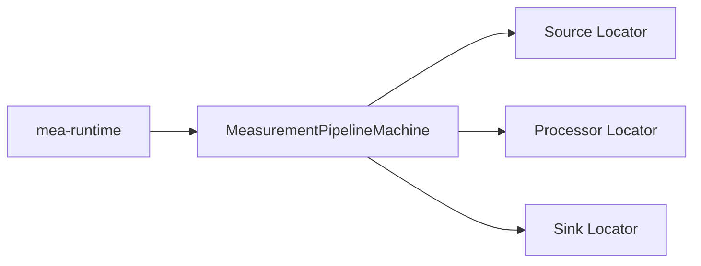
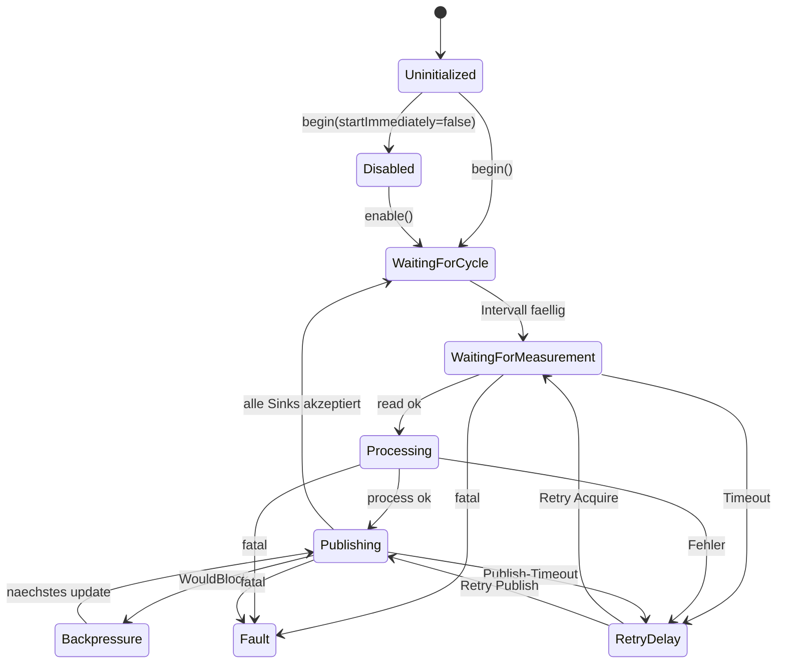

# MEA State Machine

`mea-state-machine` enthaelt die nicht blockierende
`MeasurementPipelineMachine`. Sie fuehrt eine Messwert-Pipeline aus:
Quelle -> Prozessorkette -> ein oder mehrere Sinks.

Zielstand nach Umbauplan:
[../../docs/08-UMBAUPLAN-MODULARE-EINHEIT.md](../../docs/08-UMBAUPLAN-MODULARE-EINHEIT.md).

## Rolle im Zielsystem



Die State Machine kennt keine konkreten Sensoren, Prozessoren oder Ausgaben.
Sie sieht nur IDs und Locator-Interfaces. Im Zielzustand wird sie meistens
ueber `MeasurementNode` genutzt, nicht direkt aus der Firmware.

## Zentrale Dateien

| Datei | Verantwortung |
|---|---|
| [src/MeaStateMachine.h](src/MeaStateMachine.h) | Sammel-Header |
| [src/mea/state/PipelineTypes.h](src/mea/state/PipelineTypes.h) | `PipelineConfig`, `RetryPolicy`, `PipelineState` |
| [src/mea/state/MeasurementPipelineMachine.h](src/mea/state/MeasurementPipelineMachine.h) | API |
| [src/mea/state/MeasurementPipelineMachine.cpp](src/mea/state/MeasurementPipelineMachine.cpp) | Zustandslogik |

## Zustandsmodell



## Zielnutzung ueber Runtime

```cpp
node.setDefaultTuning({1000, 2000, 500, {250, 3}, true});

node.addPipeline(ids::SoilVoltagePipeline, analogSensor)
    .through(rawToVoltage, voltageClamp)
    .into(serialSink, espNowSink);
```

Direktnutzung bleibt fuer Tests und Spezialfaelle moeglich:

```cpp
mea::MeasurementPipelineMachine machine(sources, processors, sinks, cfg);
machine.begin(nowMs);
machine.update(nowMs);
```

## Regeln

1. Die Maschine initialisiert keine Komponenten.
2. Pro `update()` wird nur begrenzte Arbeit erledigt.
3. Backpressure blockiert nicht die Loop.
4. Fatal errors fuehren in `Fault`.
5. Normale Zyklusfehler laufen ueber `RetryPolicy`.

## Abhaengigkeiten

| Dependency | Warum |
|---|---|
| [../mea-core](../mea-core) | Interfaces, `Measurement`, `Status`, Zeittypen |
| [../mea-managers](../mea-managers) | Locator-Implementierung |

## Testen

```bash
pio test -e native
```
